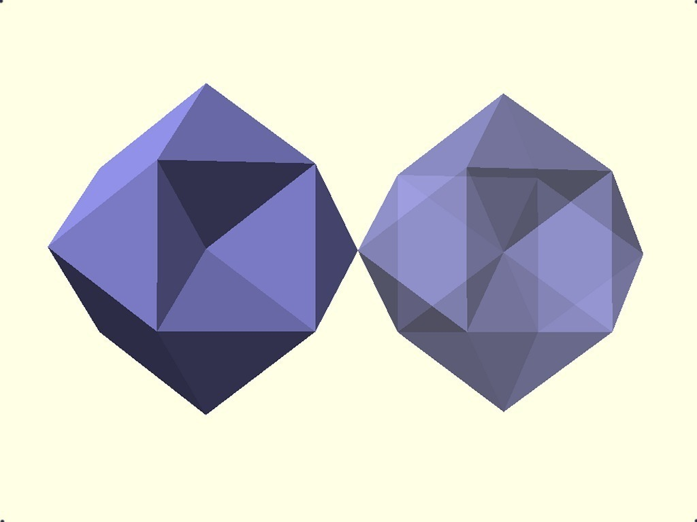
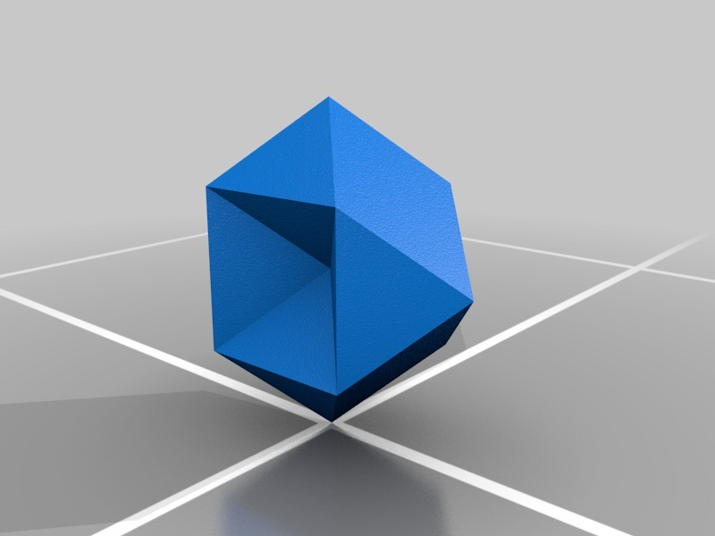

Rhombic Dodecahemioctahedron
===============
**Please note: This thing is part of a list that was [automatically generated](https://github.com/carlosgs/export-things) and may have been updated since then. Make sure to check for the current license and authorship.**  

Rhombic Dodecahemioctahedron  by MakeALot , published Oct 22, 2011

Description
--------
Another of the <a href="http://steelpillow.com/polyhedra/five_sf/five.htm" target="_blank" rel="nofollow">steelpillow.com/polyhedra/five_sf/five.htm</a> 

Instructions
--------
Join together into interesting shapes and publish/print

Files
--------

 [ RhombicDodecahemioctahedron.scad](RhombicDodecahemioctahedron.scad)  

 [ RhombicDodecahemioctahedron.stl](RhombicDodecahemioctahedron.stl)  

Pictures
--------

Tags
--------
geometry , openscad , polyhedra , Rhombic Dodecahemioctahedron  

  

License
--------
Rhombic Dodecahemioctahedron by MakeALot is licensed under the Public Domain license.  

By: Mark Durbin (MakeALot)
--------
<http://NestedCube.com/>