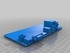

Rudimentary case for APC
===============
**Please note: This thing is part of a list that was [automatically generated](https://github.com/carlosgs/export-things) and may have been updated since then. Make sure to check for the current license and authorship.**  

Rudimentary case for APC  by MakeALot , published Nov 20, 2012

Description
--------
Rudimentary case for $49 APC (Android PC board from Via) <a href="http://apc.io/" target="_blank" rel="nofollow">apc.io/</a>

Instructions
--------
I have one of these now and I've printed a case based on the engineering drawings, it fits! 
 
Print case parts, insert board, secure with 4 @ 5mm self tapping screws, clip on lid, use. 
 
The PCB itself is just for reference, see engineering resources for more: <a href="http://apc.io/library/" target="_blank" rel="nofollow">apc.io/library/</a> 
 

Files
--------

 [ APC.stl](APC.stl)  

 [ APC_Case_Lid.stl](APC_Case_Lid.stl)  

 [ APC_Case_Base.stl](APC_Case_Base.stl)  

Pictures
--------

Tags
--------
APC , Case  

  

License
--------
Rudimentary case for APC by MakeALot is licensed under the Creative Commons - Attribution license.  

By: Mark Durbin (MakeALot)
--------
<http://NestedCube.com/>