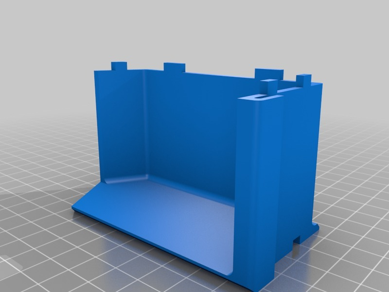
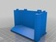
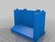
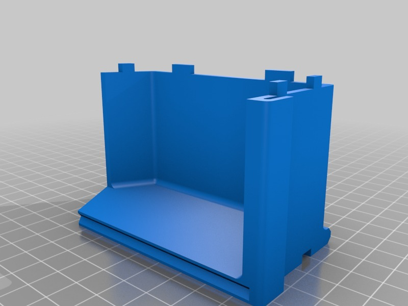
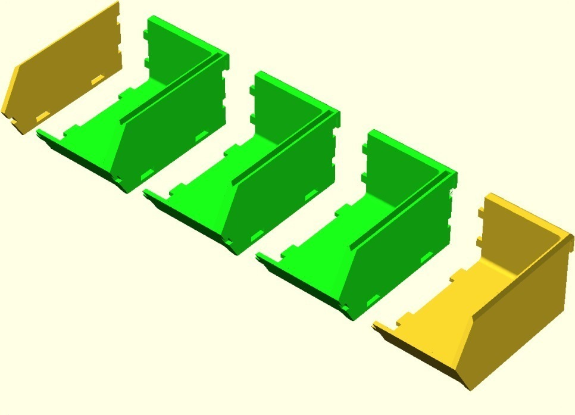

Side Stackable Component Bins / Louvre Panel Trays
===============
**Please note: This thing is part of a list that was [automatically generated](https://github.com/carlosgs/export-things) and may have been updated since then. Make sure to check for the current license and authorship.**  

Side Stackable Component Bins / Louvre Panel Trays  by MakeALot , published Jun 9, 2011

Description
--------
Just a quick mash-up to allow the bins to be joined in multiples without a side panel. There are two versions, one with the notches removed from the original part and one with the side panel added under the original part.  The second one should play well with the original bins (i.e. line up for stacking)

Instructions
--------
Print one less than the width you desire, then print one original bin and one side panel for the ends and multiple hooks from the original source: <a href="http://www.thingiverse.com/thing:9136" target="_blank" rel="nofollow">thingiverse.com/thing:9136</a> 
 
For bins that you want to remove and stack, print the original parts. 
 

Files
--------

 [ Louvre_Bin_80l50w40h_1.0_Multi.STL](Louvre_Bin_80l50w40h_1.0_Multi.STL)  

 [ multiBin.scad](multiBin.scad)  

 [ Louvre_Bin_Side_Added_80l40h_1.0.STL](Louvre_Bin_Side_Added_80l40h_1.0.STL)  

Pictures
--------

Tags
--------
container , openscad  

  

License
--------
Side Stackable Component Bins / Louvre Panel Trays by MakeALot is licensed under the Attribution - Non-Commercial - Share Alike license.  

By: Mark Durbin (MakeALot)
--------
<http://NestedCube.com/>