Slotted bowl with lid
===============
**Please note: This thing is part of a list that was [automatically generated](https://github.com/carlosgs/export-things) and may have been updated since then. Make sure to check for the current license and authorship.**  

Slotted bowl with lid  by MakeALot , published Sep 25, 2011

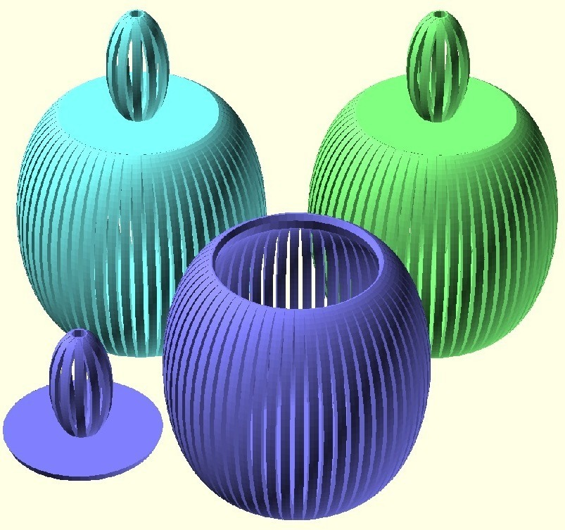

Description
--------
bowl for stuff that's small enough to fit inside and big enough to stay inside.   
 
Another trinket box...    
 
Probably look good printed by one of the people who use rainbow coloured filament.

Instructions
--------
print, fill, admire... 
 
I had to scale bowl2 to 75% to get RepG to generate the GCode, but it came out well.  Bowl3 printed at 100% and I'm very happy with the results. 
 
I have shown a picture of bowl3 with a candle inside, obviously I risked my life to bring you this shot!  Does look nice though, I may design/make an LED tea-light next... 
 
<i>Reminds me of Joe90 when it's rotating in Thingiview.</i>

Files
--------

 [ bowl2.scad](bowl2.scad)  

[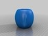](bowl2.stl)
 [ bowl2.stl](bowl2.stl)  

[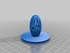](bowl3lid.stl)
 [ bowl3lid.stl](bowl3lid.stl)  

[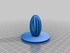](bowl2lid.stl)
 [ bowl2lid.stl](bowl2lid.stl)  

[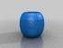](bowl3.stl)
 [ bowl3.stl](bowl3.stl)  

Pictures
--------
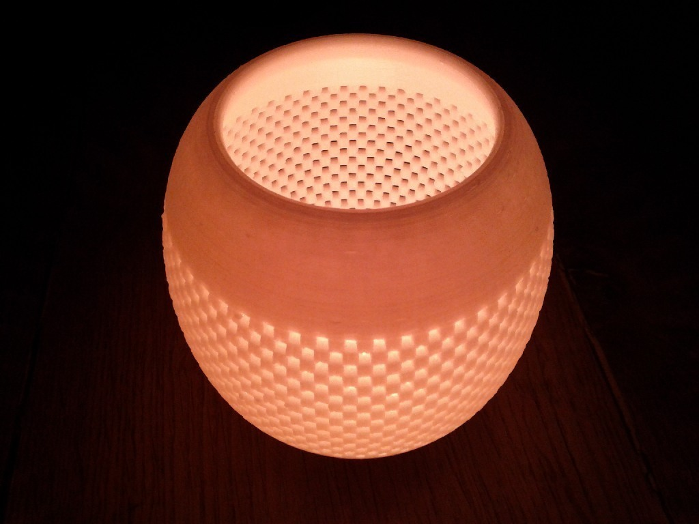
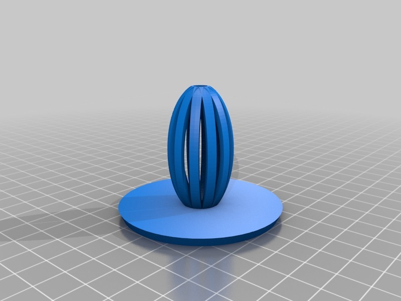
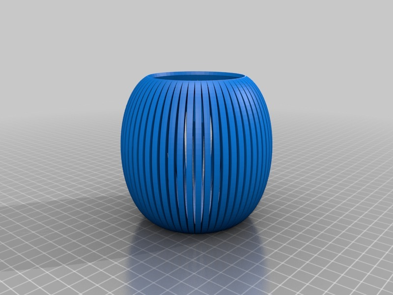
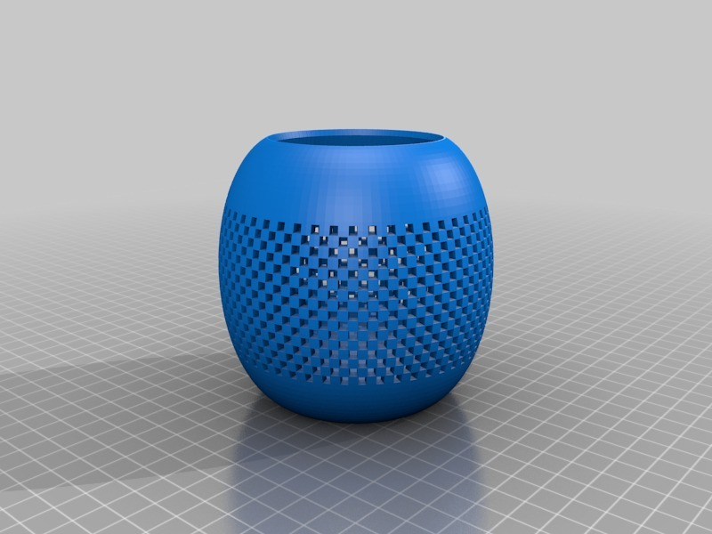
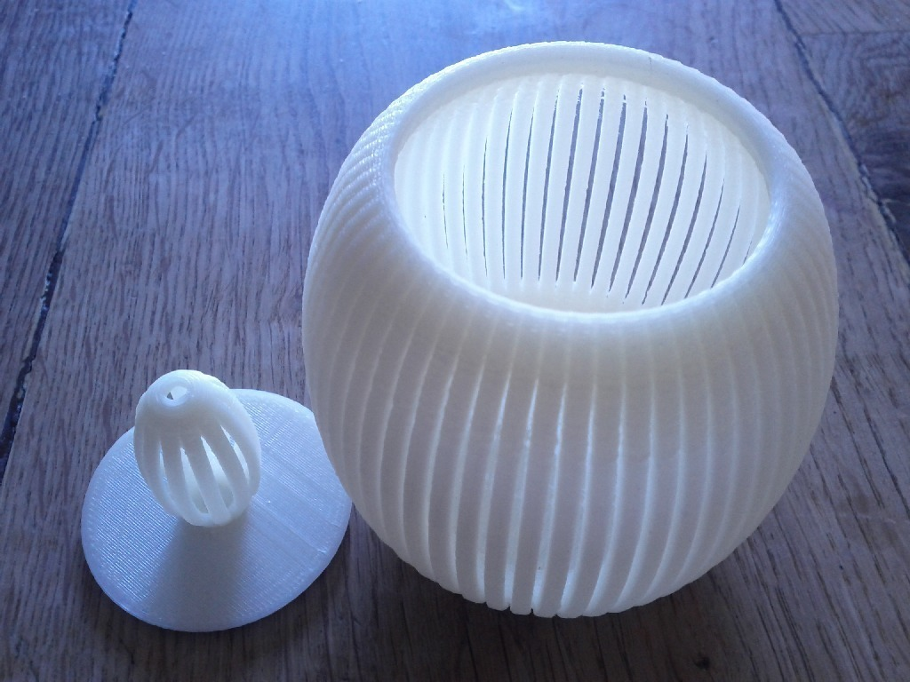

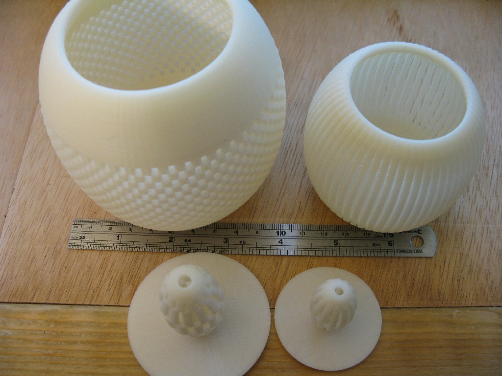
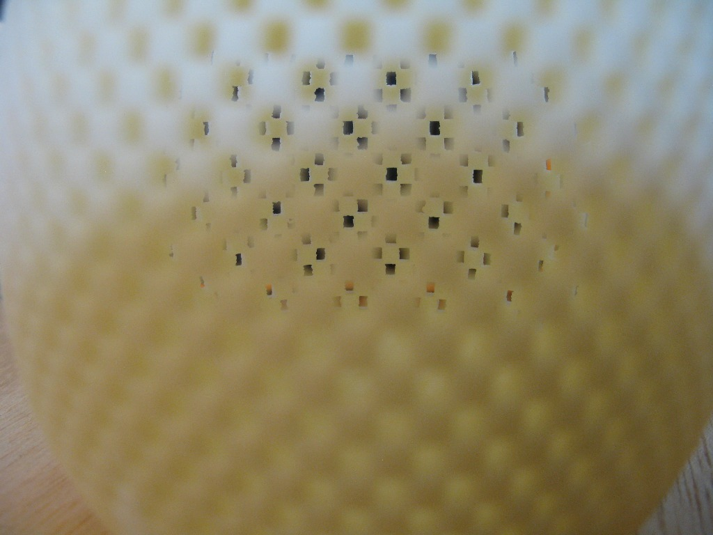
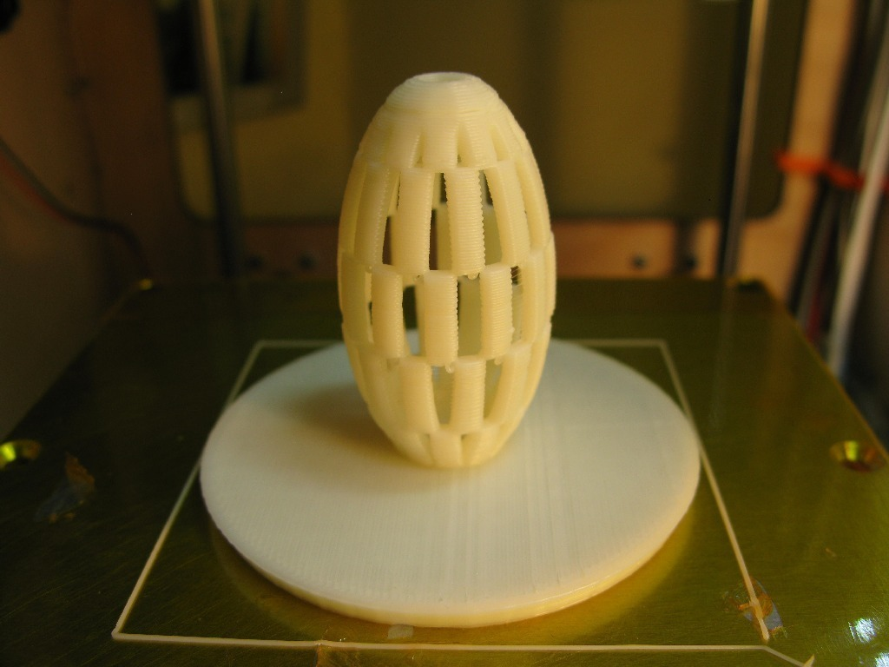

Tags
--------
container , jar , bowl , lampshade , lamp_shade , lid , openscad , slotted  

  

License
--------
Slotted bowl with lid by MakeALot is licensed under the Creative Commons - Attribution license.  

By: Mark Durbin (MakeALot)
--------
<http://NestedCube.com/>