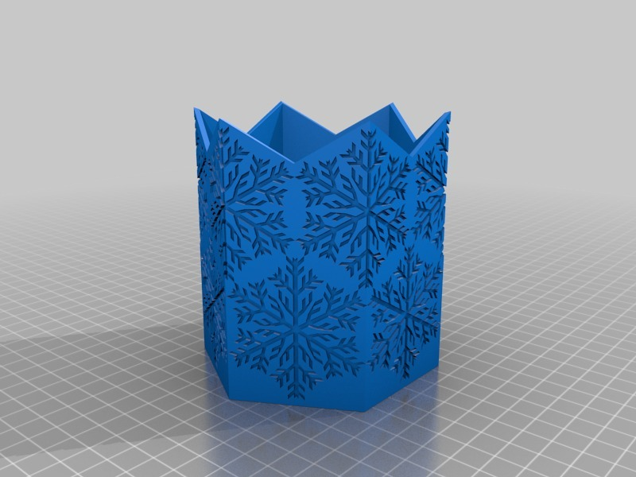
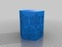
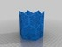
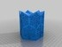
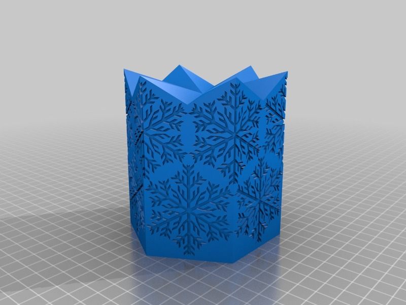
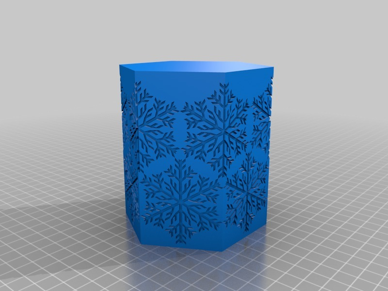
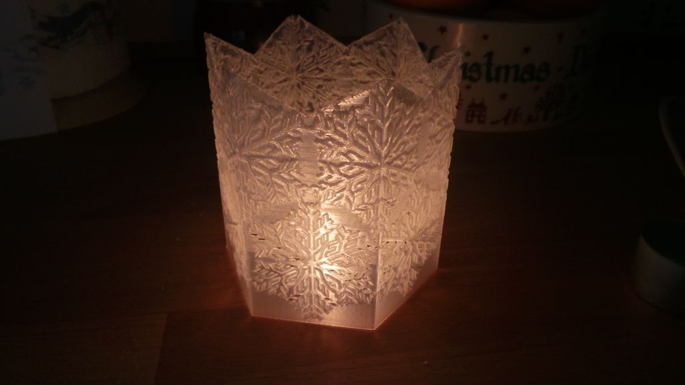
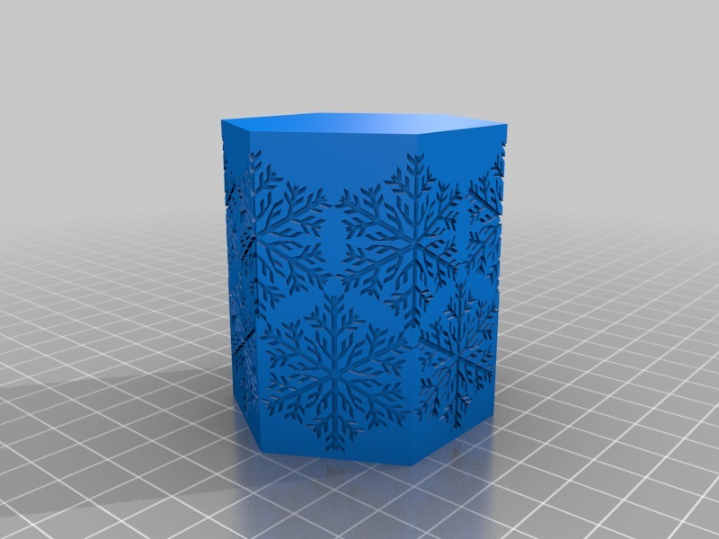
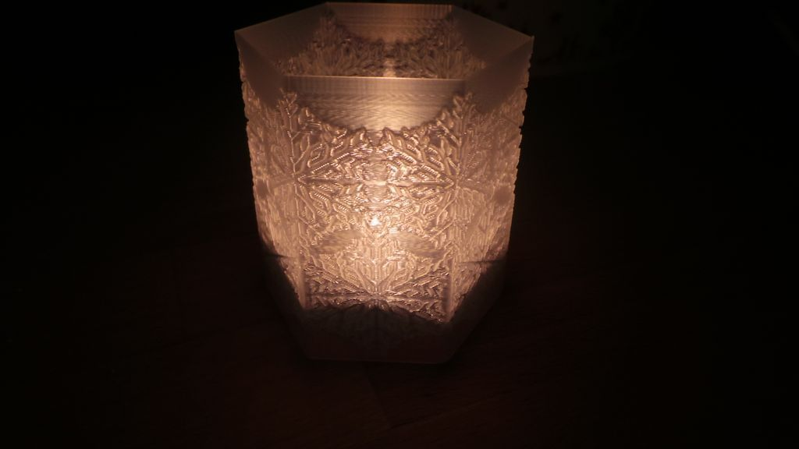
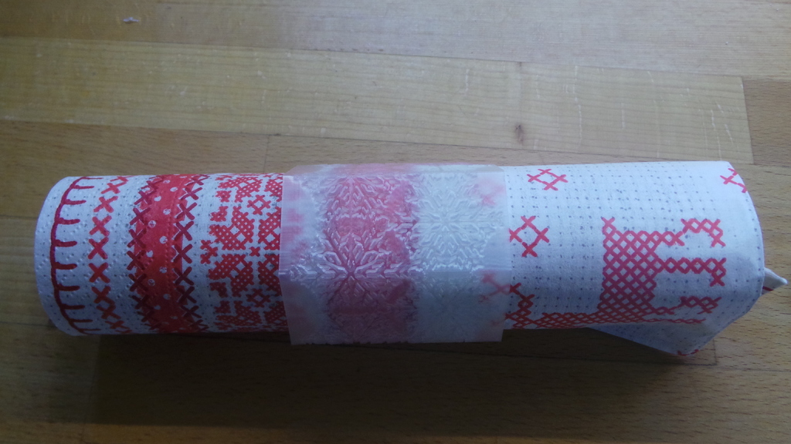

Snowflake Light holder
===============
**Please note: This thing is part of a list that was [automatically generated](https://github.com/carlosgs/export-things) and may have been updated since then. Make sure to check for the current license and authorship.**  

Snowflake Light holder  by MakeALot , published Dec 19, 2012

Description
--------
I haven't seen any snowflake designs on Thingiverse, so I thought I'd upload one. 

Instructions
--------
Print, insert tea-light/light, see the snowflake silhouettes. 
 
Obviously, only the LED tea-lights should be placed in a plastic holder, you have been warned... 
 
I've also uploaded a smaller version that works as a tea-light holder or napkin ring. 
 
BTW, if you are using Makerware and want to print a single border (a la Stretchlet) find the Makerware program folder, mine is in  
<b>C:/Program Files (x86)/MakerBot</b> 
and edit the <b>fill.csv</b> and <b>jitter.csv</b> files in  
<b>conveyor/src/main/skeinforge/Replicator slicing defaults/profiles/extrusion/ABS</b> 
setting  
<b>Activate Fill	False</b> 
and  
<b>Activate Jitter	False</b> 
respectively. Then print one of the solid models using the high setting but change the layer height to something quicker (i.e. 2.4) and everything should work.  Don't forget to re-edit the fill and jitter files for your next normal print!

Files
--------

 [ SnowflakeTealightSolid2.stl](SnowflakeTealightSolid2.stl)  

 [ SnowflakeTealight.stl](SnowflakeTealight.stl)  

 [ Snowflake_Napkin_Ring.stl](Snowflake_Napkin_Ring.stl)  

 [ SnowflakeTealightSolid.stl](SnowflakeTealightSolid.stl)  

Pictures
--------

Tags
--------
container , snowflake , tealight  

  

License
--------
Snowflake Light holder by MakeALot is licensed under the Creative Commons - Attribution license.  

By: Mark Durbin (MakeALot)
--------
<http://NestedCube.com/>