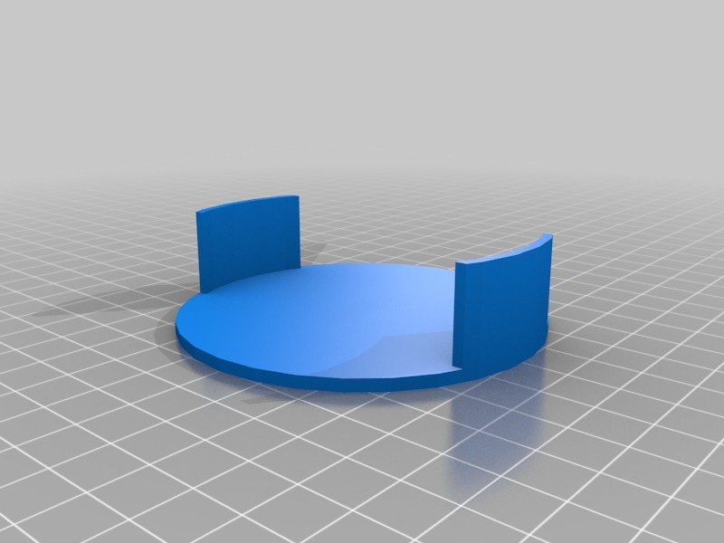
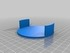
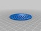
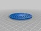
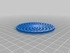
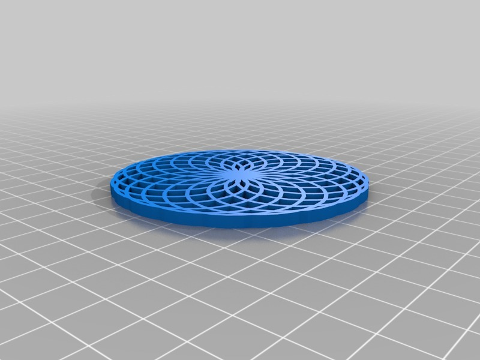
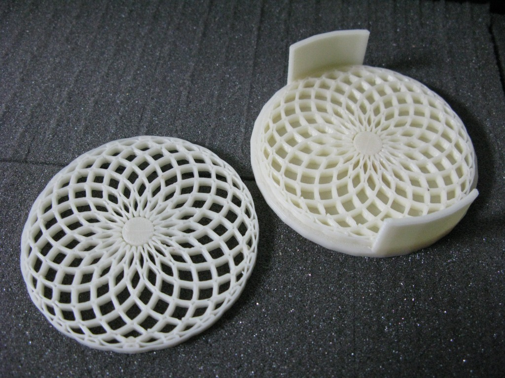
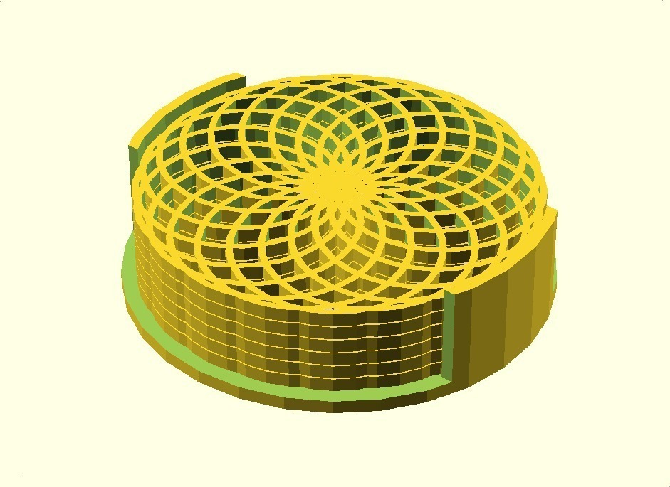
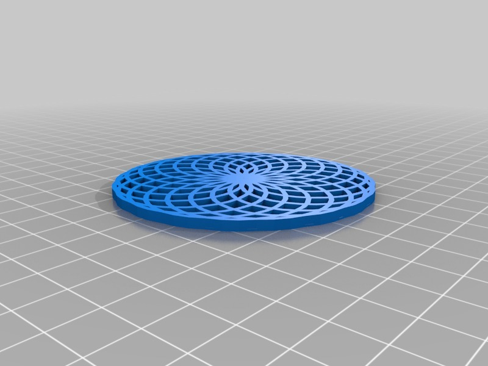
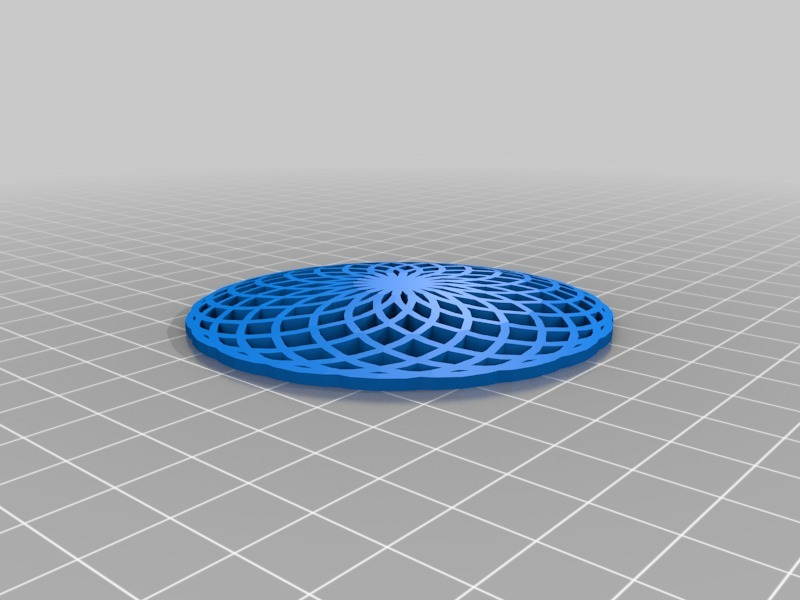

Spiro-Coasters
===============
**Please note: This thing is part of a list that was [automatically generated](https://github.com/carlosgs/export-things) and may have been updated since then. Make sure to check for the current license and authorship.**  

Spiro-Coasters  by MakeALot , published May 30, 2011

Description
--------
Spiro-graph coasters (Cup/Glass/Beer/Wine Mats) and holder 
Somewhere to put down your charmed glasses <a href="http://www.thingiverse.com/thing:8920" target="_blank" rel="nofollow">thingiverse.com/thing:8920</a> 
 
Print them in glow-in-the-dark ABS to help your party goers find them! 
 
The holder will hold up to 6 coasters. 
 
<i>Added one with a thin back for NYCDesigner and anyone else who wants to try a two colour print!</i> 
 
The domed one is for Bluemetal to try as a speaker cover <b>I wouldn't use this as a coaster unless you really want to confuse your drunk guests (and don't mind the mess :)</b>

Instructions
--------
You know what to do...

Files
--------

 [ SpiroMatHolder.stl](SpiroMatHolder.stl)  

 [ SpiroCoasters.scad](SpiroCoasters.scad)  

 [ DomedSpiroMat.stl](DomedSpiroMat.stl)  

 [ SpiroMat.stl](SpiroMat.stl)  

 [ BackedSpiroMat.stl](BackedSpiroMat.stl)  

Pictures
--------

Tags
--------
cup mat , spirograph , coaster , openscad  

  

License
--------
Spiro-Coasters by MakeALot is licensed under the Creative Commons - Attribution license.  

By: Mark Durbin (MakeALot)
--------
<http://NestedCube.com/>