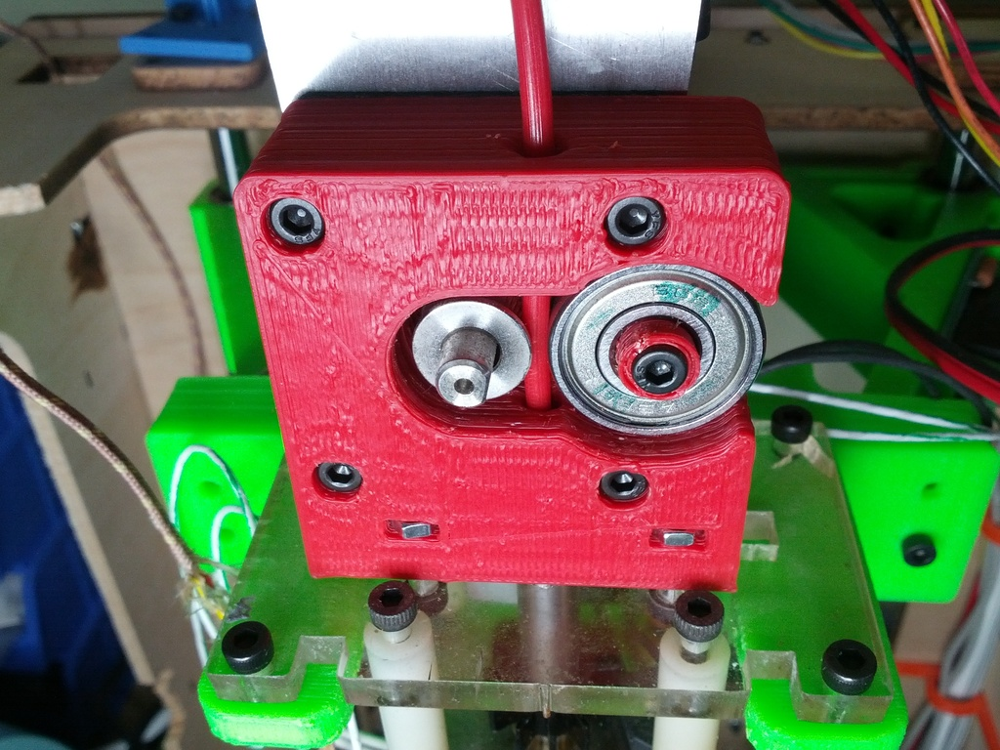
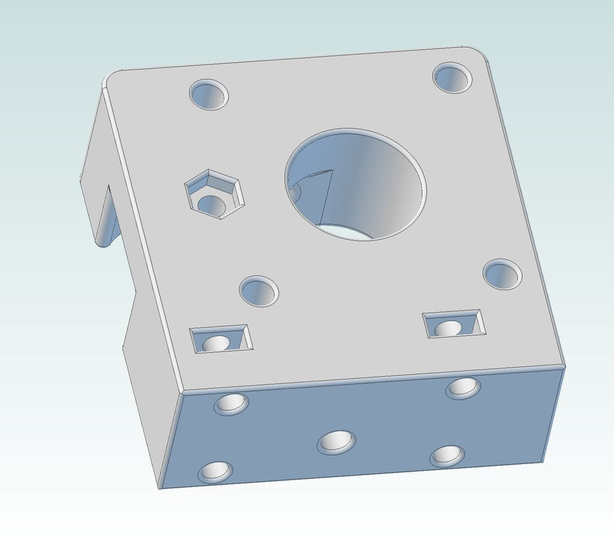

Springless, drop In ToM MK6+ replacement
===============
**Please note: This thing is part of a list that was [automatically generated](https://github.com/carlosgs/export-things) and may have been updated since then. Make sure to check for the current license and authorship.**  

Springless, drop In ToM MK6+ replacement  by MakeALot , published Oct 9, 2012

Description
--------
Drop in replacement for my MK6+ 3mm extruder using 608 bearing instead of Delrin plunger.

Instructions
--------
I know, Sooo last year darling... 
 
There are several of these already, but I couldn't find one without springs, gears, etc. 
 
If this is a duplicate, please let me know in the comments and I'll happily make it a derivative. 
 
My MK6+ still has a fair bit of 3mm filament to work through and it finally gave up extruding.   
 
I taped it up and managed to print this replacement, phew. 
 
This is for anyone in the same boat.

Files
--------

 [ MK6+608DropinExtruder.stl](MK6+608DropinExtruder.stl)  

Pictures
--------

Tags
--------
608Z , extruder , MK6  

  

License
--------
Springless, drop In ToM MK6+ replacement by MakeALot is licensed under the Creative Commons - Attribution license.  

By: Mark Durbin (MakeALot)
--------
<http://NestedCube.com/>