Stacking/Sliding Drawer Boxes
===============
**Please note: This thing is part of a list that was [automatically generated](https://github.com/carlosgs/export-things) and may have been updated since then. Make sure to check for the current license and authorship.**  

Stacking/Sliding Drawer Boxes  by MakeALot , published Nov 14, 2012

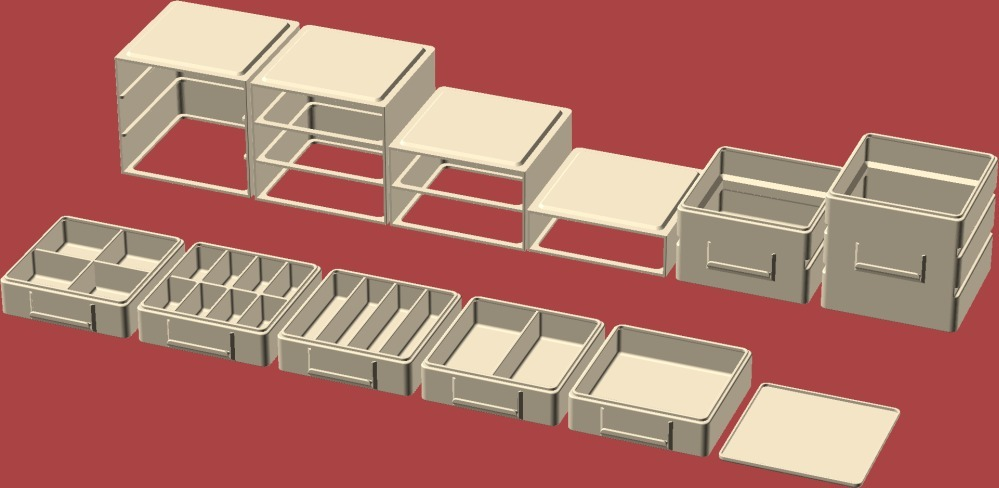

Description
--------
Component boxes that stack and slot into rails that also stack all printable in 100x100x100

Instructions
--------
I need some nice small boxes that I can stack or use as drawers for all my small components, now, I could go and buy some, but where would the fun be in that. 
 
Print one every time your bot is quiet (not often then) maybe set one printing before you go to work. 
 
Mix in what ever combinations fits your stuff. 
 
Use the open fronted rails if you want to be able to use the double/triple height drawers. 
 
Update:  I've printed most parts now, the only issue I've come up against is that the double and triple drawers don't go into the runners properly (because I forgot the recess in the back)  I've added that to both of them now.   
 
I've also added a lid so that you can keep the contents of the top box safe

Files
--------
[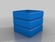](Triple_Height_Stacker.stl)
 [ Triple_Height_Stacker.stl](Triple_Height_Stacker.stl)  

[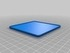](Stacker_Lid.stl)
 [ Stacker_Lid.stl](Stacker_Lid.stl)  

 [ Stacker_2_div.stl](Stacker_2_div.stl)  

[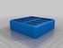](Stacker_8_div.stl)
 [ Stacker_8_div.stl](Stacker_8_div.stl)  

[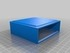](Single_Rail.stl)
 [ Single_Rail.stl](Single_Rail.stl)  

[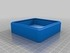](Stacker_Empty.stl)
 [ Stacker_Empty.stl](Stacker_Empty.stl)  

 [ Stacker_cross_div.stl](Stacker_cross_div.stl)  

 [ Triple_Rail.stl](Triple_Rail.stl)  

[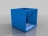](Triple_Rail_Open.stl)
 [ Triple_Rail_Open.stl](Triple_Rail_Open.stl)  

[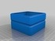](Double_Height_Stacker.stl)
 [ Double_Height_Stacker.stl](Double_Height_Stacker.stl)  

[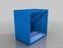](Double_Rail.stl)
 [ Double_Rail.stl](Double_Rail.stl)  

[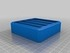](Stacker_4_div.stl)
 [ Stacker_4_div.stl](Stacker_4_div.stl)  

Pictures
--------
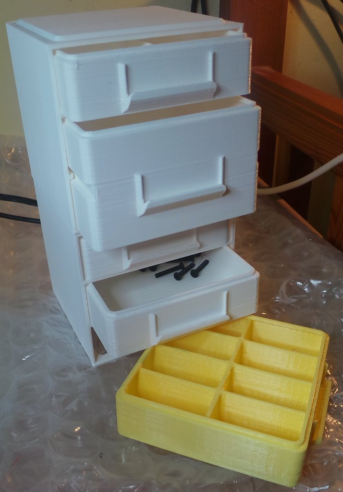
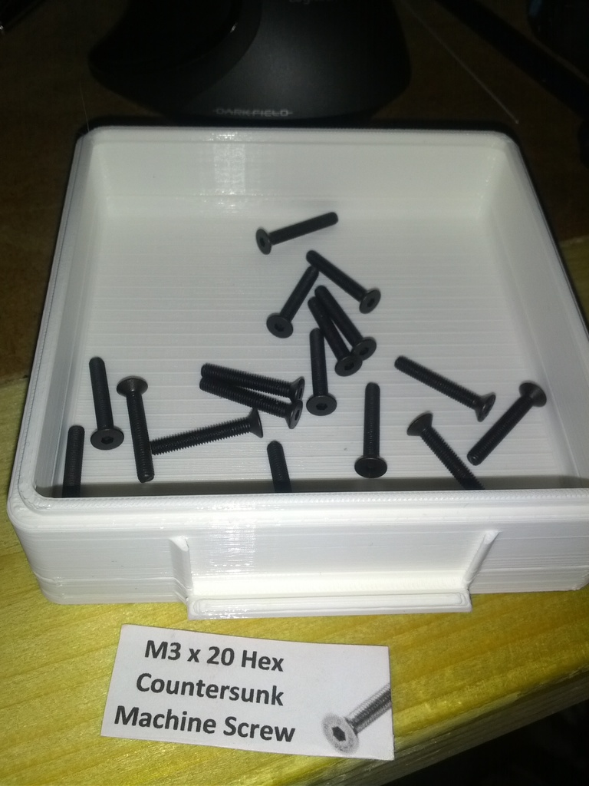
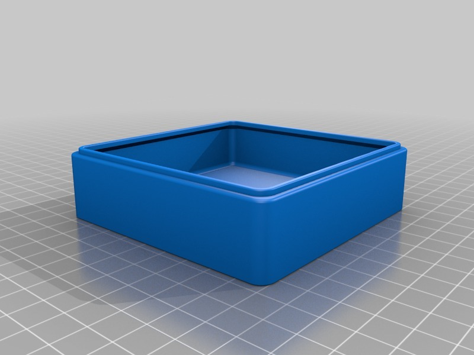
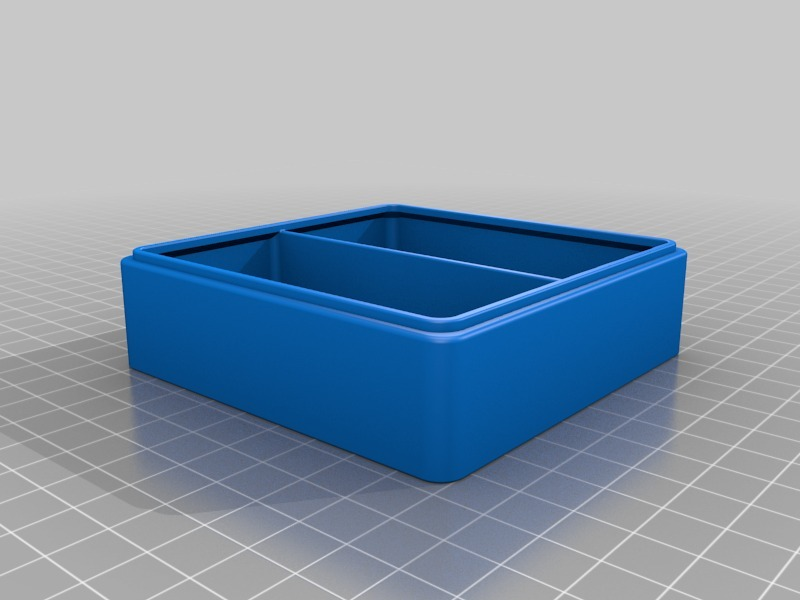

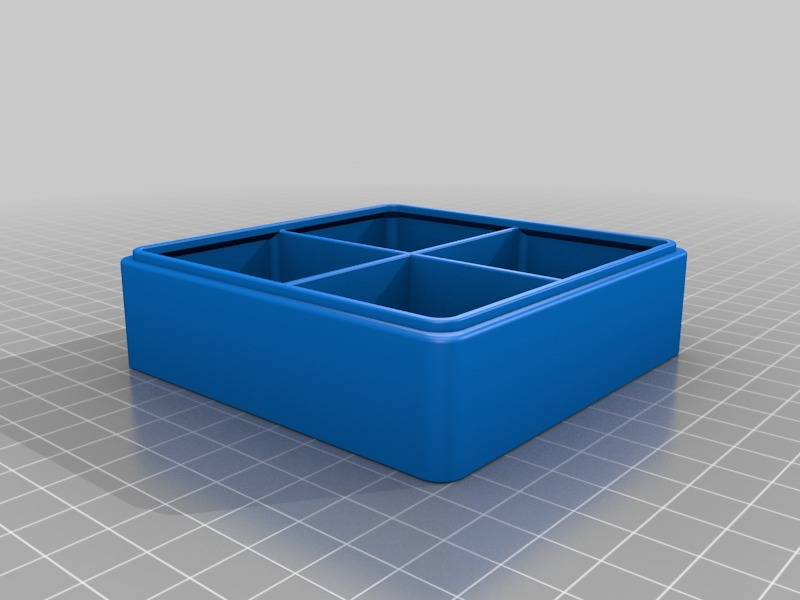
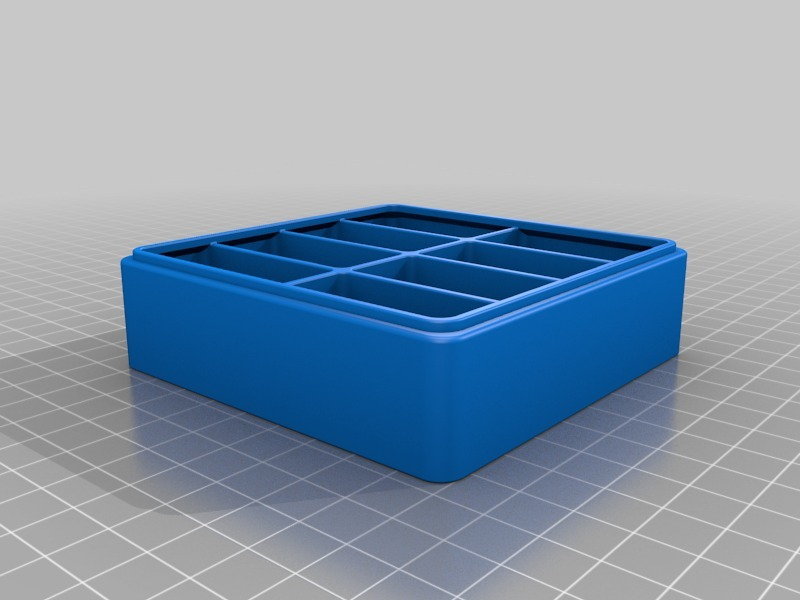
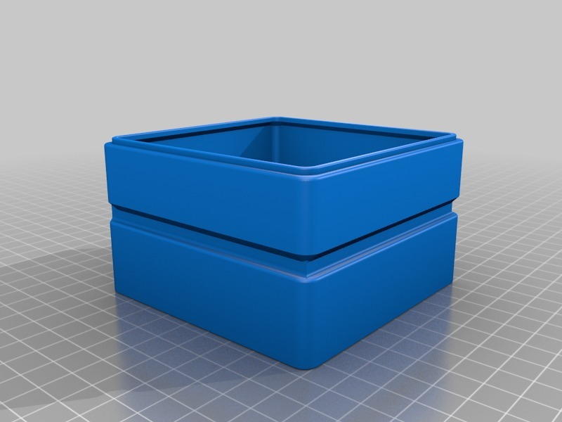
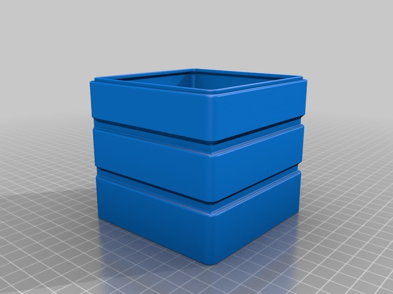
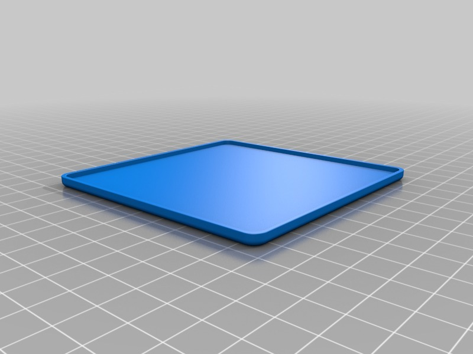
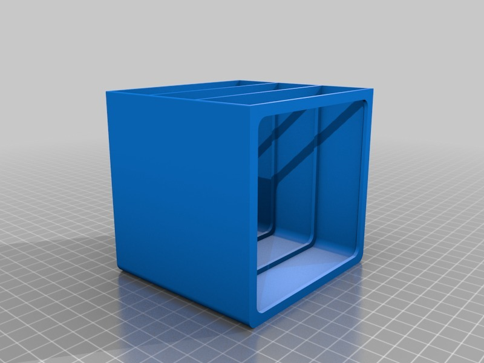
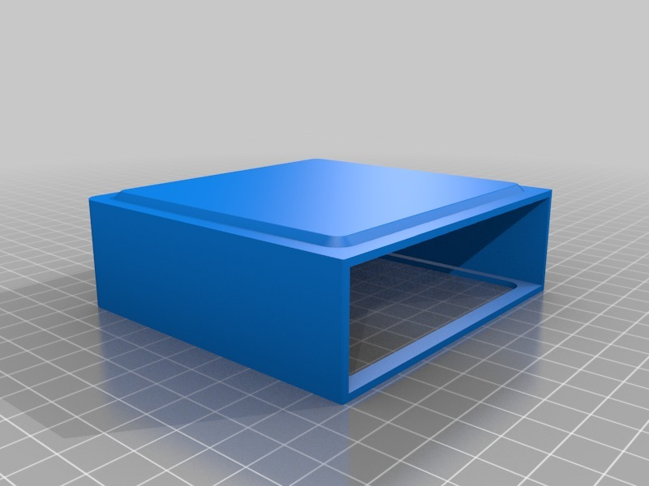
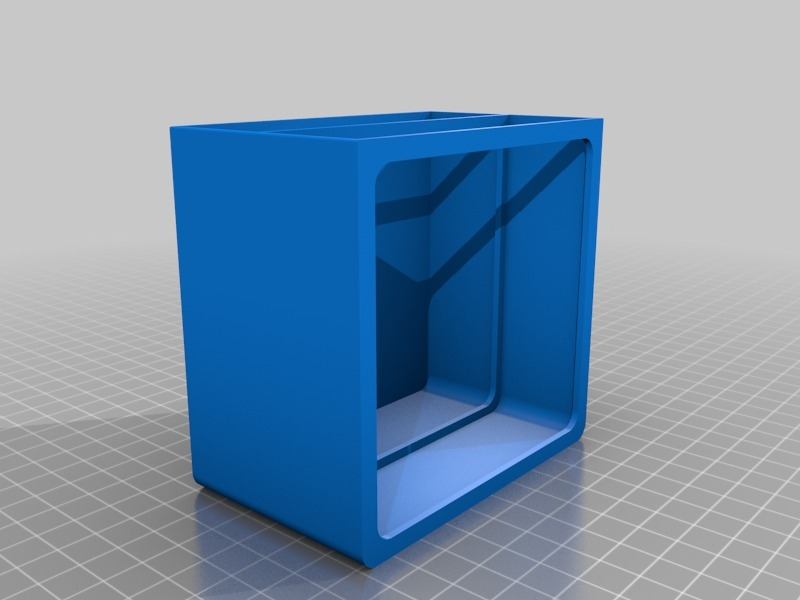
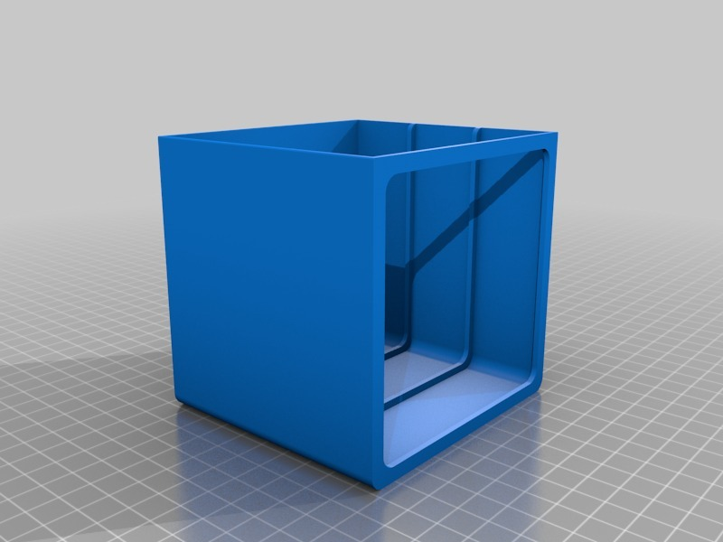
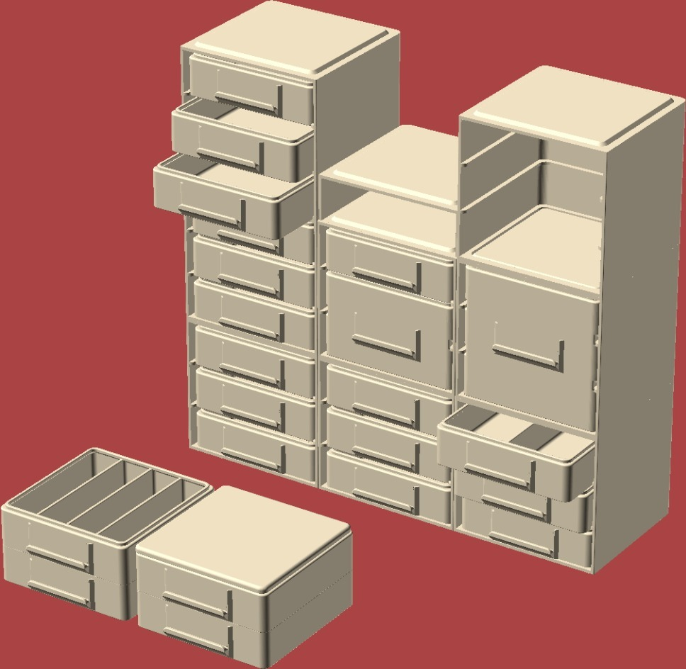

Tags
--------
None  

  

License
--------
Stacking/Sliding Drawer Boxes by MakeALot is licensed under the Creative Commons - Attribution license.  

By: Mark Durbin (MakeALot)
--------
<http://NestedCube.com/>