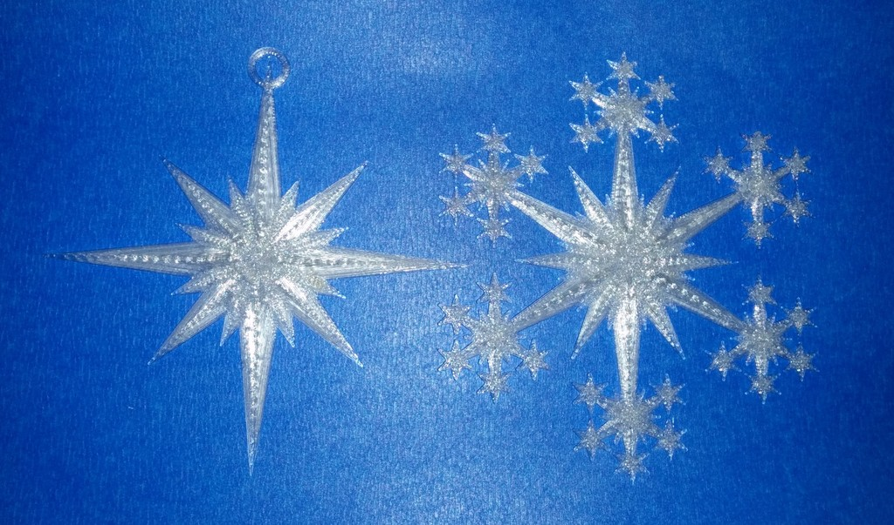
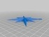
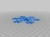
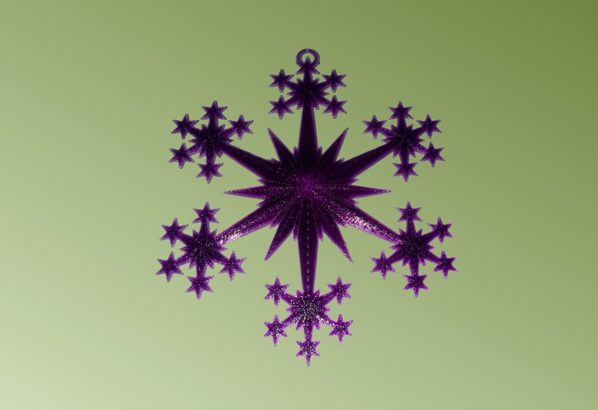
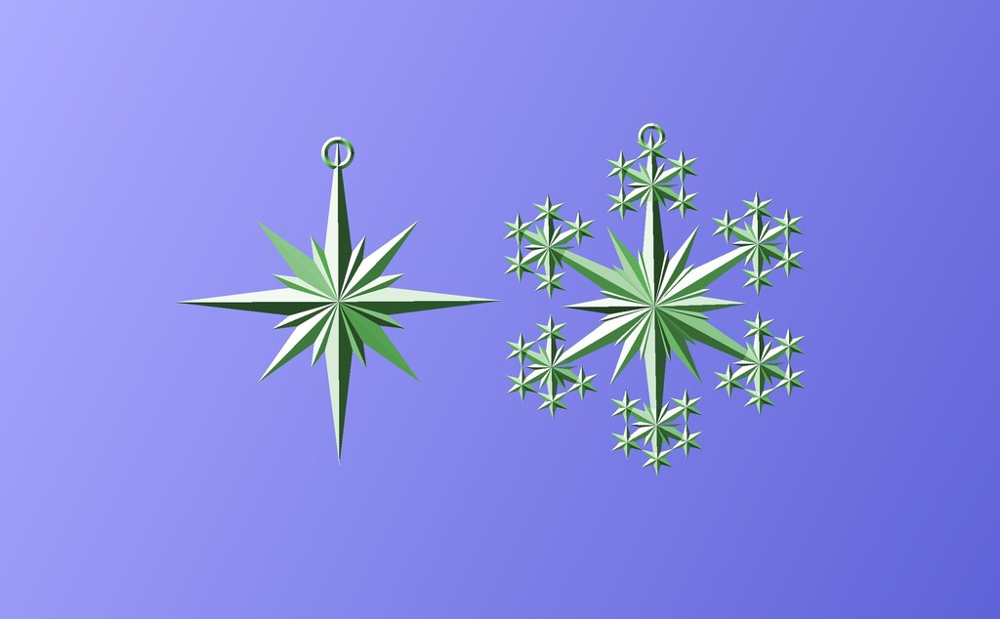

Star and Snowflake Star Ornament
===============
**Please note: This thing is part of a list that was [automatically generated](https://github.com/carlosgs/export-things) and may have been updated since then. Make sure to check for the current license and authorship.**  

Star and Snowflake Star Ornament  by MakeALot , published Nov 28, 2013

Description
--------
Star and snowflake star tree ornaments   
 
Hang them in the tree, in windows or on strings around the room particularly good made of translucent filament in front of fairy lights/LEDs.   
 
Look really nice in clear PLA or T-Glase, just like frost on your window.

Instructions
--------
None

Files
--------

 [ ClearStar.stl](ClearStar.stl)  

 [ ClearStar2.stl](ClearStar2.stl)  

 [ ClearStar2.scad](ClearStar2.scad)  

 [ ClearStar.scad](ClearStar.scad)  

Pictures
--------

Tags
--------
bagatelle , Bauble , bibelot , Christmas , Christmas_ornaments , christmas_tree , curiosity , frippery , furbelow , gewgaw , gimcrack , gimmick , knick-knack , MakerBotOrnaments , novelty , Ornament , plaything , Snowflake , Star , toy , Tree , trifle , trinket  

  

License
--------
Star and Snowflake Star Ornament by MakeALot is licensed under the Creative Commons - Attribution license.  

By: Mark Durbin (MakeALot)
--------
<http://NestedCube.com/>