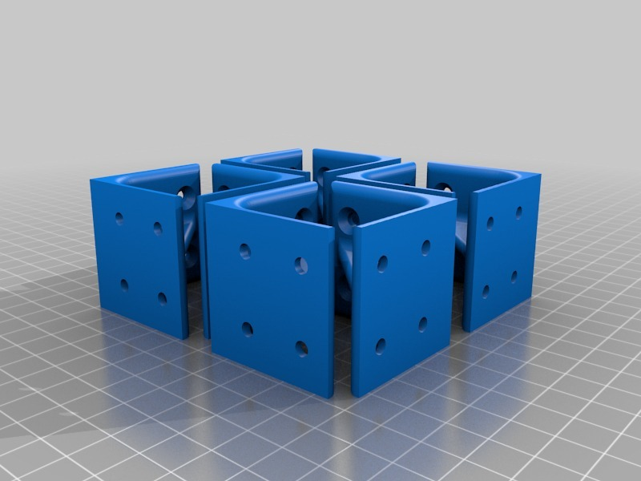
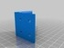
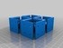
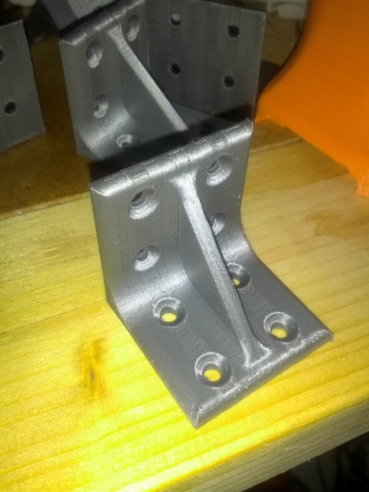
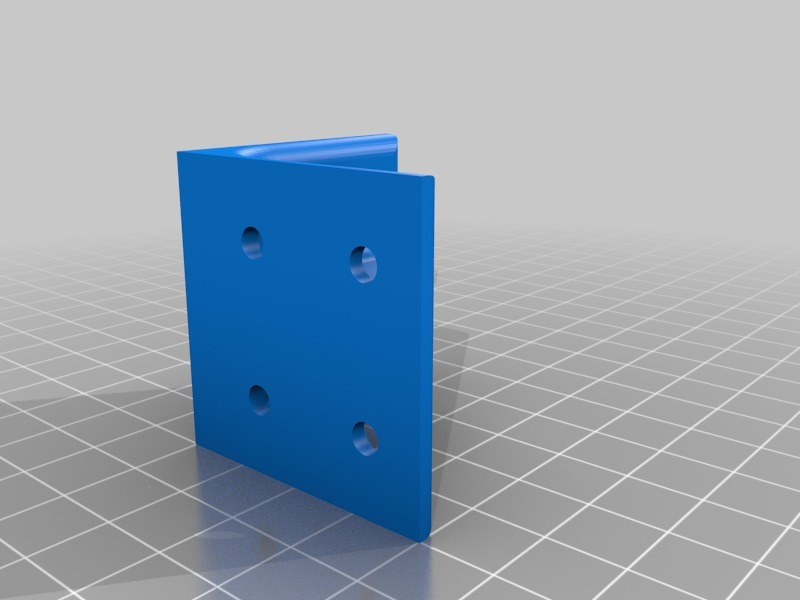

Strong little bracket
===============
**Please note: This thing is part of a list that was [automatically generated](https://github.com/carlosgs/export-things) and may have been updated since then. Make sure to check for the current license and authorship.**  

Strong little bracket  by MakeALot , published Nov 13, 2012

Description
--------
A strong little bracket

Instructions
--------
I needed a little bracket for fixing a desk to the wall, it needed to be strong and small.   
 
So here it is, if anyone else wants it!

Files
--------

 [ Bracket.stl](Bracket.stl)  

 [ brackets.stl](brackets.stl)  

Pictures
--------

Tags
--------
bracket  

  

License
--------
Strong little bracket by MakeALot is licensed under the Creative Commons - Attribution license.  

By: Mark Durbin (MakeALot)
--------
<http://NestedCube.com/>