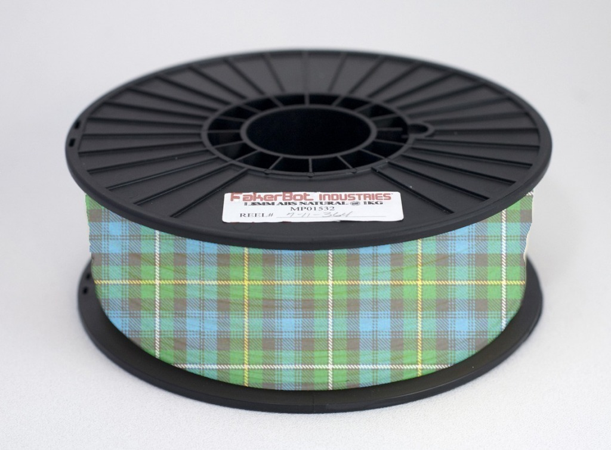

Tartan ABS available in 3mm and 1.75mm
===============
**Please note: This thing is part of a list that was [automatically generated](https://github.com/carlosgs/export-things) and may have been updated since then. Make sure to check for the current license and authorship.**  

Tartan ABS available in 3mm and 1.75mm  by MakeALot , published Mar 31, 2011

Description
--------
<b><big>This has now exceeded it's shelf life and will not be available again until next year</big></b> 
 
I managed to find a supplier of Tartan ABS in China. 
The supplier says that they are also able to manufacture spotted and striped versions, but only in 3mm. (apparently the spots are too big to fit on the 1.75 mm and the stripes slide off) 
 
I'm assured that the PLA versions will follow and an intriguing Sky-blue Pink that I can't wait to see. 
 
I'm already imagining all the things I can make:  Holes for rivets, Sky hooks, Long weights, Left handed screwdrivers, Sharp string, the list is endless... 
 
<b>Update:</b> 
Shipping will start on the 31st of April. 

Instructions
--------
Place tongue firmly in cheek, and smile.

Files
--------

Tags
--------
April fool , April fools , tartan  

  

License
--------
Tartan ABS available in 3mm and 1.75mm by MakeALot is licensed under the BSD License license.  

By: Mark Durbin (MakeALot)
--------
<http://NestedCube.com/>