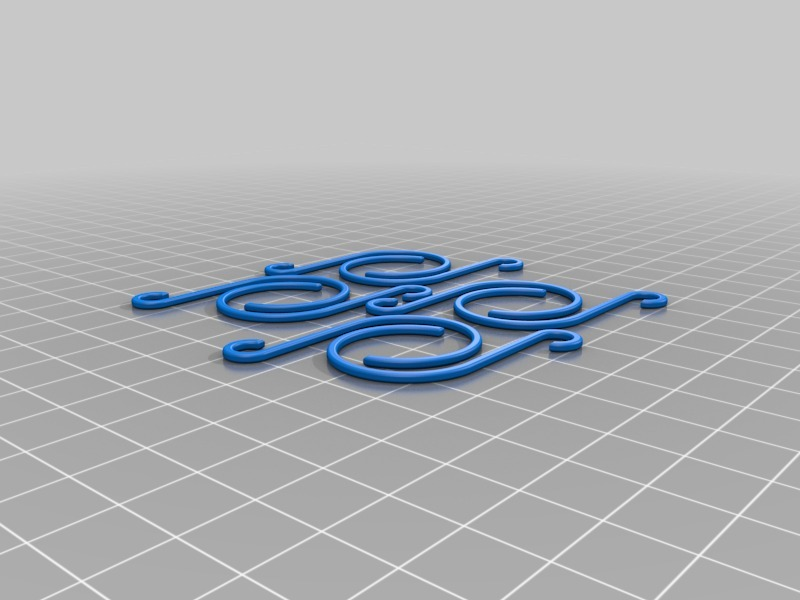
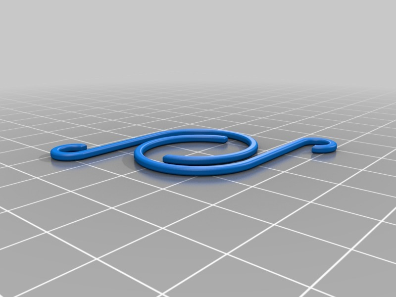

Tree Ornament Hooks
===============
**Please note: This thing is part of a list that was [automatically generated](https://github.com/carlosgs/export-things) and may have been updated since then. Make sure to check for the current license and authorship.**  

Tree Ornament Hooks  by MakeALot , published Dec 6, 2012

Description
--------
We ran out of hooks, I couldn't find any wire. So.  10 minutes later 8 tree decoration hooks.

Instructions
--------
Print, hang baubles.   
 
Rescale, print two larger ones - Ear ornament hooks (Office party sorted)   
 
Added a quick tutorial here:

Files
--------

 [ 2_Ornament_Hooks.stl](2_Ornament_Hooks.stl)  

 [ Ornament_Hooks.stl](Ornament_Hooks.stl)  

Pictures
--------

Tags
--------
bauble , christmas , decoration , holiday , hook , MakerBotOrnaments , ornament , tree  

  

License
--------
Tree Ornament Hooks by MakeALot is licensed under the Creative Commons - Attribution license.  

By: Mark Durbin (MakeALot)
--------
<http://NestedCube.com/>