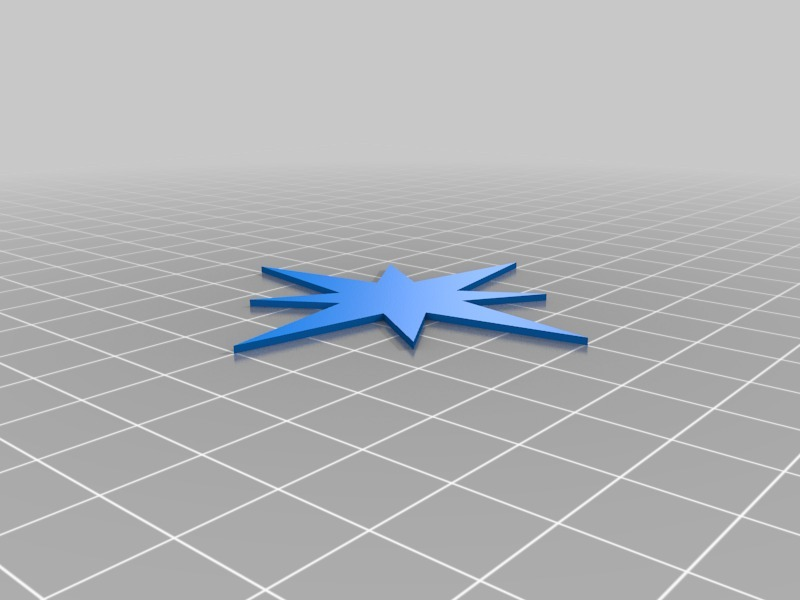

Trinket boxes
===============
**Please note: This thing is part of a list that was [automatically generated](https://github.com/carlosgs/export-things) and may have been updated since then. Make sure to check for the current license and authorship.**  

Trinket boxes  by MakeALot , published Nov 14, 2012

Description
--------
Some little boxes for trinkets

Instructions
--------
All lids fit all boxes. 
 
The lids are a press fit and difficult to remove initially, but get easier after the first few goes. You could scale them up a little if you'd prefer a loose fit. 
 
The star should press fit into the star lid if you want to try a different colour. 

Files
--------

 [ tbox3.stl](tbox3.stl)  

 [ tbox1.stl](tbox1.stl)  

 [ tboxes.rar](tboxes.rar)  

 [ tboxes.stl](tboxes.stl)  

 [ tboxlid2.stl](tboxlid2.stl)  

 [ tboxlid3.stl](tboxlid3.stl)  

 [ tbox2.stl](tbox2.stl)  

 [ tboxlidstar.stl](tboxlidstar.stl)  

 [ tboxlid1.stl](tboxlid1.stl)  

Pictures
--------

Tags
--------
box , trinket  

  

License
--------
Trinket boxes by MakeALot is licensed under the Creative Commons - Attribution license.  

By: Mark Durbin (MakeALot)
--------
<http://NestedCube.com/>