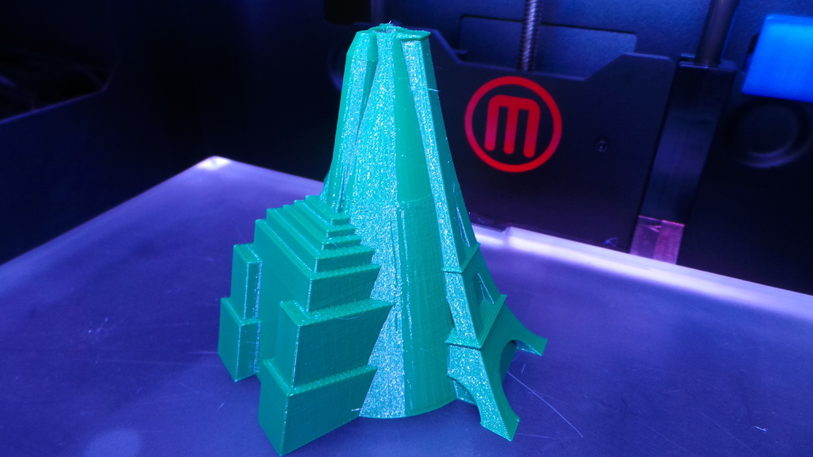
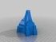
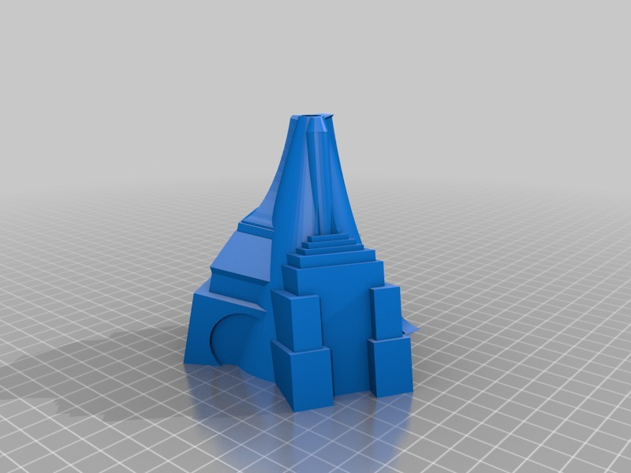

Triple Tower Vase
===============
**Please note: This thing is part of a list that was [automatically generated](https://github.com/carlosgs/export-things) and may have been updated since then. Make sure to check for the current license and authorship.**  

Triple Tower Vase  by MakeALot , published Oct 29, 2013

Description
--------
Vase made from Paris' Eiffel Tower, New York's Empire State Building and London's Big Ben.   
 
This is still a work in progress, I intend to add more detail to each of the towers, but it's functional as is.

Instructions
--------
None

Files
--------

 [ TriTowers.stl](TriTowers.stl)  

Pictures
--------

Tags
--------
Big_Ben , Eiffel_Tower , Empire_State , London , NewYork , New_York , Paris , Vase  

  

License
--------
Triple Tower Vase by MakeALot is licensed under the Creative Commons - Attribution license.  

By: Mark Durbin (MakeALot)
--------
<http://NestedCube.com/>