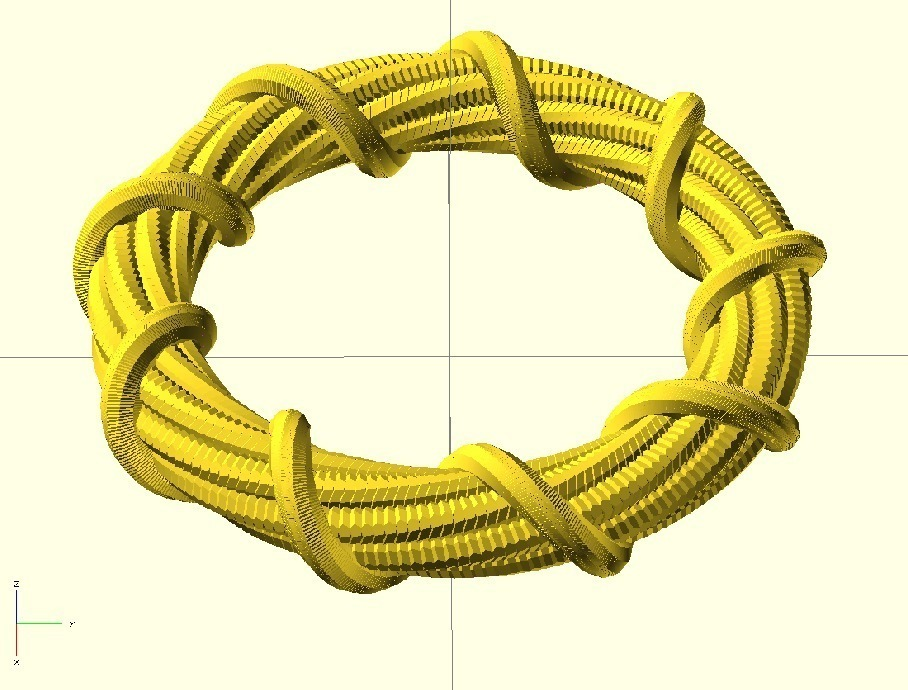
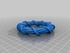
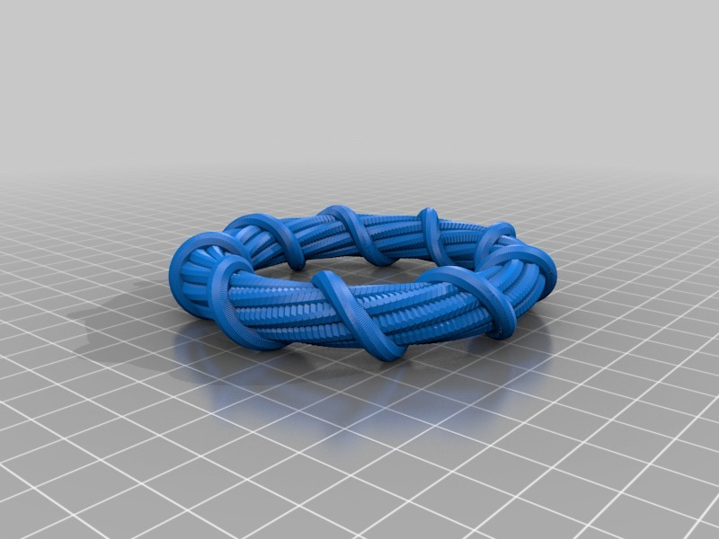
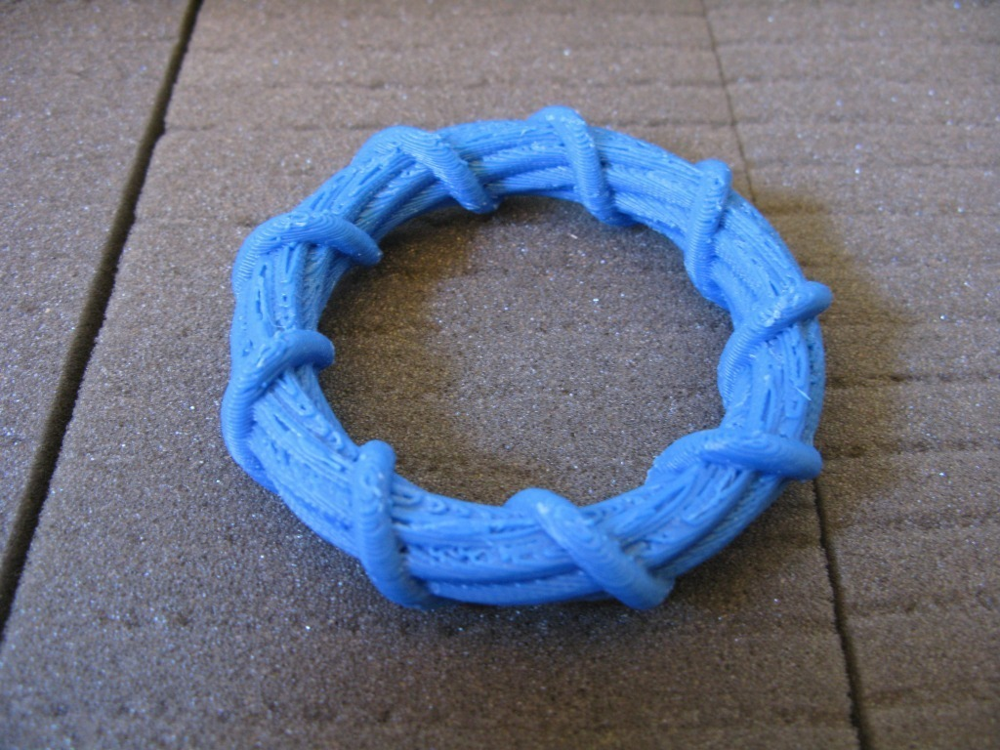
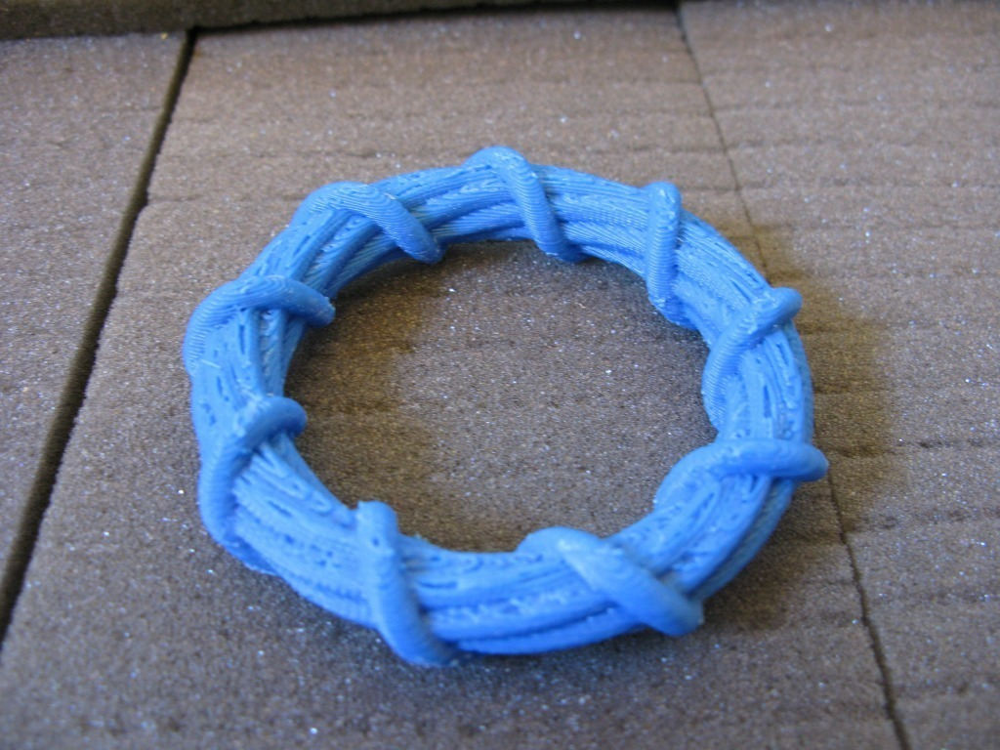
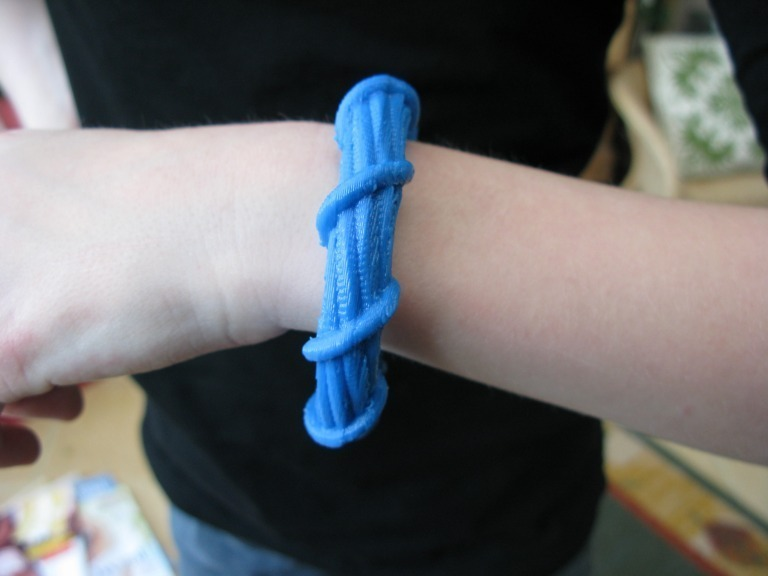

Twisted bracelet
===============
**Please note: This thing is part of a list that was [automatically generated](https://github.com/carlosgs/export-things) and may have been updated since then. Make sure to check for the current license and authorship.**  

Twisted bracelet  by MakeALot , published Mar 9, 2011

Description
--------
Twisted bracelet 
 
I finally managed to generate the STL for this, it took 15.5 days and needed an Ubuntu installation on a machine with 4G ram and the latest CGAL libs.

Instructions
--------
This needed support to print!

Files
--------

 [ bracelet.scad](bracelet.scad)  

 [ TwistedBracelet.stl](TwistedBracelet.stl)  

Pictures
--------

Tags
--------
bracelet , openscad , spiral  

  

License
--------
Twisted bracelet by MakeALot is licensed under the Creative Commons - Attribution - Share Alike license.  

By: Mark Durbin (MakeALot)
--------
<http://NestedCube.com/>