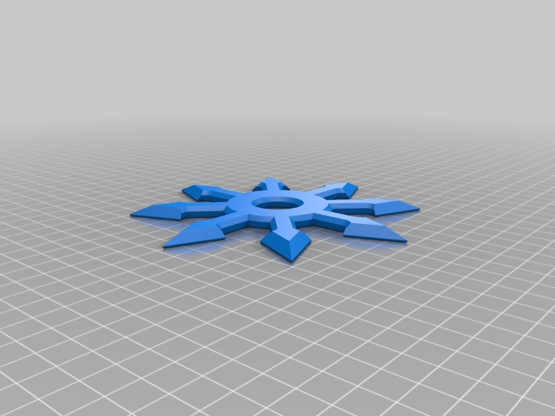
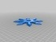

War Gaming Symbol
===============
**Please note: This thing is part of a list that was [automatically generated](https://github.com/carlosgs/export-things) and may have been updated since then. Make sure to check for the current license and authorship.**  

War Gaming Symbol  by MakeALot , published Dec 5, 2012

Description
--------
My son was reading an excellent article by Amanda Darby on the 3D Printing Industry website and wanted one of these, but with 8 points. 
 
<a href="http://3dprintingindustry.com/2012/12/06/how-3d-printing-fits-into-my-chosen-career-of-model-making/" target="_blank" rel="nofollow">3dprintingindustry.com/2012/12/06/how-3d-printing-fits-into-my-chosen-career-of-model-making/</a> 
 
You should also see <a href="http://amandadarby.wordpress.com/" target="_blank" rel="nofollow">amandadarby.wordpress.com/</a> 
For some *real* model making, 
 
Anyway, I though someone else might want one to stick on their bedroom door.

Instructions
--------
Print, paint, then stick on door.

Files
--------

 [ WHStar.stl](WHStar.stl)  

Tags
--------
fighting_star , war_games  

  

License
--------
War Gaming Symbol by MakeALot is licensed under the Creative Commons - Attribution license.  

By: Mark Durbin (MakeALot)
--------
<http://NestedCube.com/>