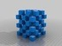

XOR-able objects
===============
**Please note: This thing is part of a list that was [automatically generated](https://github.com/carlosgs/export-things) and may have been updated since then. Make sure to check for the current license and authorship.**  

XOR-able objects  by MakeALot , published Sep 20, 2011

Description
--------
Objects to 3D XOR with other objects to make checked/striped/spotted (even gingham - for picnics) items in two colours 
 
Best utilised when we can get a two colour Candystruder (CandyFab acknowledged). Hey, what about milk and white chocolate... 
 
And, of course, there's <b>tartan</b> for anyone who thought that I was only joking...

Instructions
--------
Take two STLs, one that you prepared earlier and one XOR stl. 
 
Then use OpenSCAD to create a positive: 
<b>difference() { 
   import_stl("stlNumber1.stl",convexity=15); 
   import_stl("Check.stl",convexity=15); 
}</b> 
and export STL. 
 
Create support (or second colour) 
<b>intersection() { 
   import_stl("stlNumber1.stl",convexity=15); 
   import_stl("Check.stl",convexity=15); 
}</b> 
and export STL. 
 
Now place in a medium temperature twin 3D printer until golden brown. 
 

Files
--------

 [ Check.stl](Check.stl)  

 [ QRCode.stl](QRCode.stl)  

 [ Resultant_STLs.rar](Resultant_STLs.rar)  

 [ Tubes.stl](Tubes.stl)  

 [ Spots.stl](Spots.stl)  

 [ Gingham.stl](Gingham.stl)  

 [ mbCandyCane.stl](mbCandyCane.stl)  

 [ tartan.stl](tartan.stl)  

 [ Rods.stl](Rods.stl)  

Pictures
--------

Tags
--------
checks , dual , gingham , rings , stripes , 2color , candy , candycane , dual extrusion , dual material , dualstrusion , openscad , script , soluble support , spots , tartan , Useful , Useful script  

  

License
--------
XOR-able objects by MakeALot is licensed under the Creative Commons - Attribution license.  

By: Mark Durbin (MakeALot)
--------
<http://NestedCube.com/>