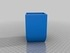

basic receptacles
===============
**Please note: This thing is part of a list that was [automatically generated](https://github.com/carlosgs/export-things) and may have been updated since then. Make sure to check for the current license and authorship.**  

basic receptacles  by MakeALot , published Oct 3, 2011

Description
--------
Some receptacle forms for slicing/hacking. 
 
Here are 15 basic printable (without support) shapes that can be produced in 3, 4, 5, 6, 7, 8, 9, 10, 11, 12, 13, 14, 15, 16, 17, 18, 19, 20 and 100 sided versions. 
That's over 300 basic shapes before scaling, chopping, merging, etc. 
I've posted up the 100 sided versions as STLs and some examples of the others so that you can just print them if you don't feel like playing with OpenSCAD. If you can't find the one you want, let me know the shape and how many sides and I'll pop up an STL for you. 
 
I think that's enough for now - maybe I'll make some lids for them another time.

Instructions
--------
use OpenSCAD to intersect one of these with rotated/translated cubes etc. to make new shapes. 
 
<b>example: to produce Pot1slotted.stl</b> 
intersection() { 
import_stl("Pot1.stl",convexity=3); 
 
for (i=[0:17]) { 
rotate([0,0,i*10])translate([0,0,50])cube([100,5,100],center=true); 
translate([0,0,2.5+i*8])cube([100,100,5],center=true); 
} 
 
} 
each of the pots is defined using a different module in OpenSCAD, receptacle0() to receptacle14() each of these modules takes 2 parameters, the number of sides, and the angle to rotate the toroids to line them up with the cylinders (there is a list in the file). 
 
The examples I've generated below are: 
Pot03.stl - receptacle0(3,30); 
Pot44.stl - receptacle4(4,0); 
Pot85.stl - receptacle8(5,-18); 
Pot99.stl - receptacle9(9,-10); 
 
If you'd like to generate an STL not here e.g. a 7 sided version of receptacle 3, use receptacle3(7,90/7); You can then scale the width,depth and height to suit your needs. Once you have a basic STL, you can re-import as described above to decorate it with slots, impressions, etc. 
 
 
<b> Update:</b> 
I've added a module drawReceptacle(number=0,sides=3) that takes a receptacle number 0-15 and a number of sides 3-20 (anything else produces the 100 sided version)

Files
--------

 [ Pot44.stl](Pot44.stl)  

 [ HexStarPot8.stl](HexStarPot8.stl)  

 [ Pot13.stl](Pot13.stl)  

 [ bowlNoSlots.stl](bowlNoSlots.stl)  

 [ Pot030303ra.stl](Pot030303ra.stl)  

 [ hexbowl.stl](hexbowl.stl)  

 [ Pot10.stl](Pot10.stl)  

 [ Pot6.stl](Pot6.stl)  

 [ pumppot.stl](pumppot.stl)  

 [ HexPentaPot.stl](HexPentaPot.stl)  

 [ HexiDeciPot.stl](HexiDeciPot.stl)  

 [ longHoneyPot.stl](longHoneyPot.stl)  

 [ shortHoneyPot.stl](shortHoneyPot.stl)  

 [ Pot1slotted.stl](Pot1slotted.stl)  

 [ Pot0303.stl](Pot0303.stl)  

 [ Pot14.stl](Pot14.stl)  

 [ Pot85.stl](Pot85.stl)  

 [ Pot030303.stl](Pot030303.stl)  

 [ receptacle.scad](receptacle.scad)  

 [ Pot99.stl](Pot99.stl)  

 [ Pot03slotted.stl](Pot03slotted.stl)  

 [ Pot2.stl](Pot2.stl)  

 [ Pot1.stl](Pot1.stl)  

 [ Pot0303b.stl](Pot0303b.stl)  

 [ honeyPot.stl](honeyPot.stl)  

 [ Pot03.stl](Pot03.stl)  

 [ Pot11.stl](Pot11.stl)  

 [ Pot12.stl](Pot12.stl)  

 [ Pot7.stl](Pot7.stl)  

 [ Pot8.stl](Pot8.stl)  

 [ CPot.stl](CPot.stl)  

 [ Pot9.stl](Pot9.stl)  

 [ HexiCosPot.stl](HexiCosPot.stl)  

Pictures
--------

Tags
--------
bowl , jar , OpenSCAD , receptacle , featured , honeycomb , pot  

  

License
--------
basic receptacles by MakeALot is licensed under the Creative Commons - Attribution license.  

By: Mark Durbin (MakeALot)
--------
<http://NestedCube.com/>