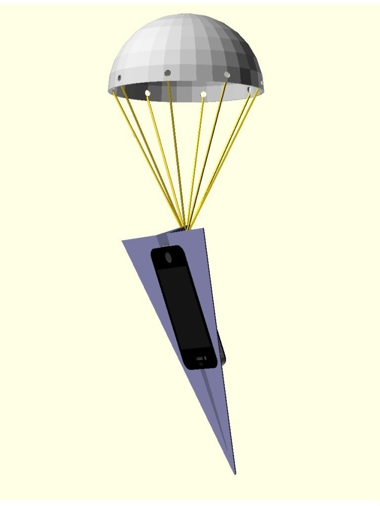

iFlown (with Awe-chute)
===============
**Please note: This thing is part of a list that was [automatically generated](https://github.com/carlosgs/export-things) and may have been updated since then. Make sure to check for the current license and authorship.**  

iFlown (with Awe-chute)  by MakeALot , published Mar 3, 2012

Description
--------
You know how it is, your buddy has just gone downstairs to the parking lot and his phone rings.  He doesn't need to miss that call. Load his phone into the handy iFlown and throw it to him out of the window. 
 
Awe-chute (Awesome Chute) also included for when you realise it was your phone ringing. (usually accompanied by the cry of "Awe Shoot"). 
 
Thanks to Lars Srup for the phone model <a href="http://www.thingiverse.com/thing:12879" target="_blank" rel="nofollow">thingiverse.com/thing:12879</a>

Instructions
--------
Print and: 
 
   Keep handy for passing phone between friends. 
 
   Mass phone drop marketing campaigns (attach awechute and drop masses of phones from low flying aircraft)  
 
   Phone sharing 
 
   Passing phones between cars on the highway (please note, this has not been tested at speeds greater than 70mph) 
 
   etc... 
 
Can be used with sling shot for long distance flights.

Files
--------

 [ iFlown.stl](iFlown.stl)  

 [ AweShoot.stl](AweShoot.stl)  

Pictures
--------

Tags
--------
EvD , iPhone  

  

License
--------
iFlown (with Awe-chute) by MakeALot is licensed under the Creative Commons - Attribution license.  

By: Mark Durbin (MakeALot)
--------
<http://NestedCube.com/>