linkBracelet (or Ring when scaled!)
===============
**Please note: This thing is part of a list that was [automatically generated](https://github.com/carlosgs/export-things) and may have been updated since then. Make sure to check for the current license and authorship.**  

linkBracelet (or Ring when scaled!)  by MakeALot , published Mar 27, 2011

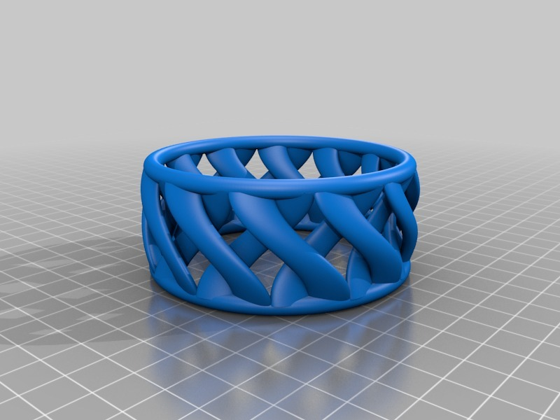

Description
--------
__Added a finer version as OpenSCAD is now more capable__   
Bracelet based on Spiral Link cup <a href="http://www.thingiverse.com/thing:6917" target="_blank" rel="nofollow">thingiverse.com/thing:6917</a>  
Scaled it down to 20mm diameter and made in silver - my daughter loves it!   
 

Instructions
--------
It's a little small for most hands, it was designed to go on my daughter's wrist (and she's built like a racing snake) so scale it up in replicatorG to suit your needs.

Files
--------
[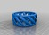](linkBracelet_Fine.stl)
 [ linkBracelet_Fine.stl](linkBracelet_Fine.stl)  

 [ linkBracelet.scad](linkBracelet.scad)  

[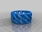](linkBracelet.stl)
 [ linkBracelet.stl](linkBracelet.stl)  

 [ linkBracelet_Fine.scad](linkBracelet_Fine.scad)  

Pictures
--------

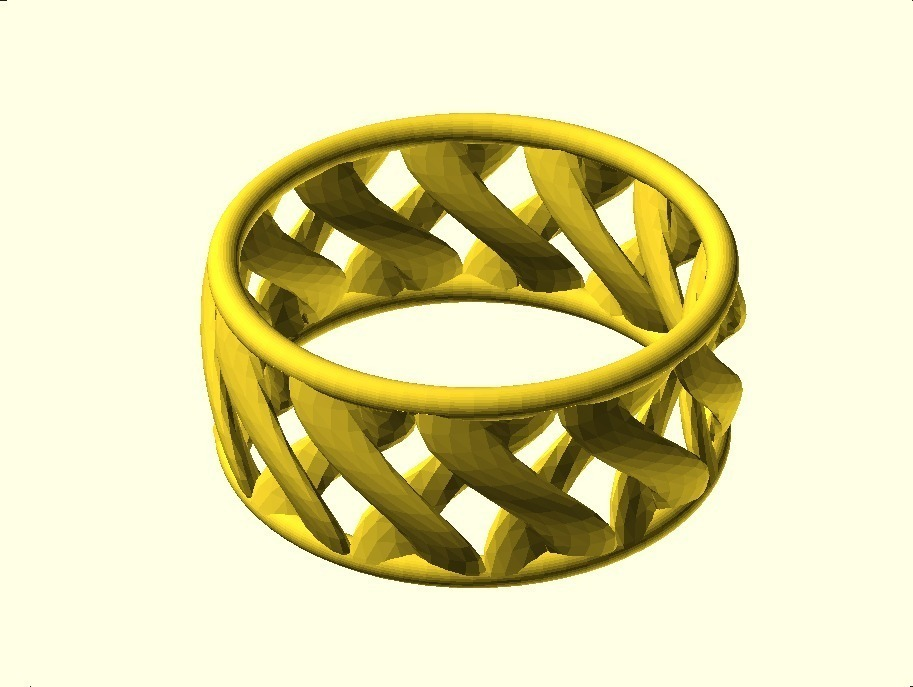
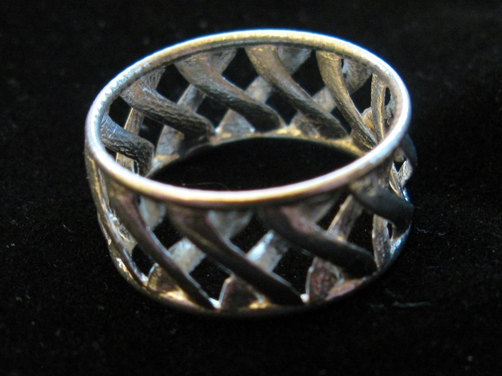
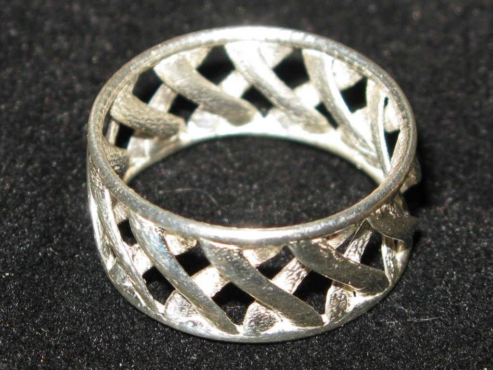
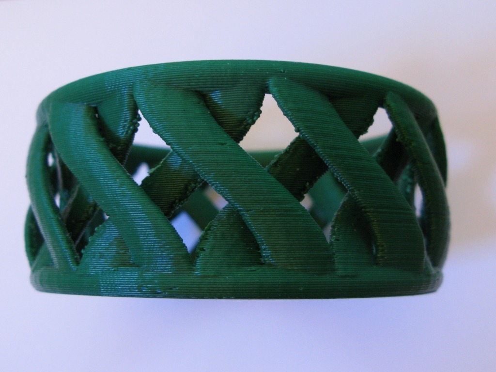
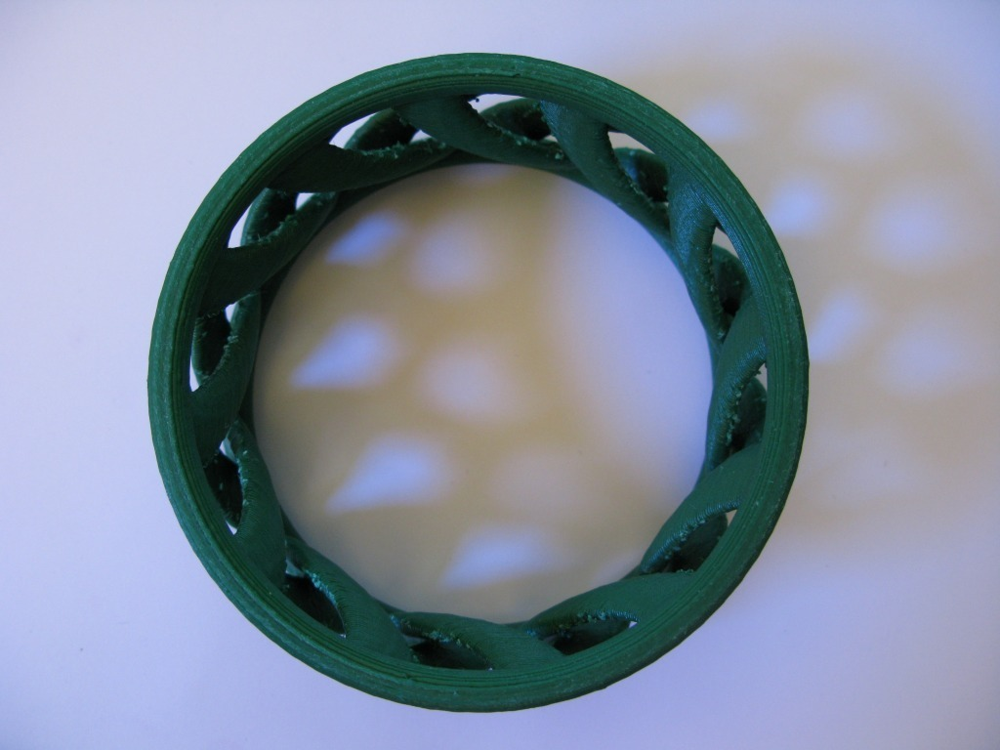
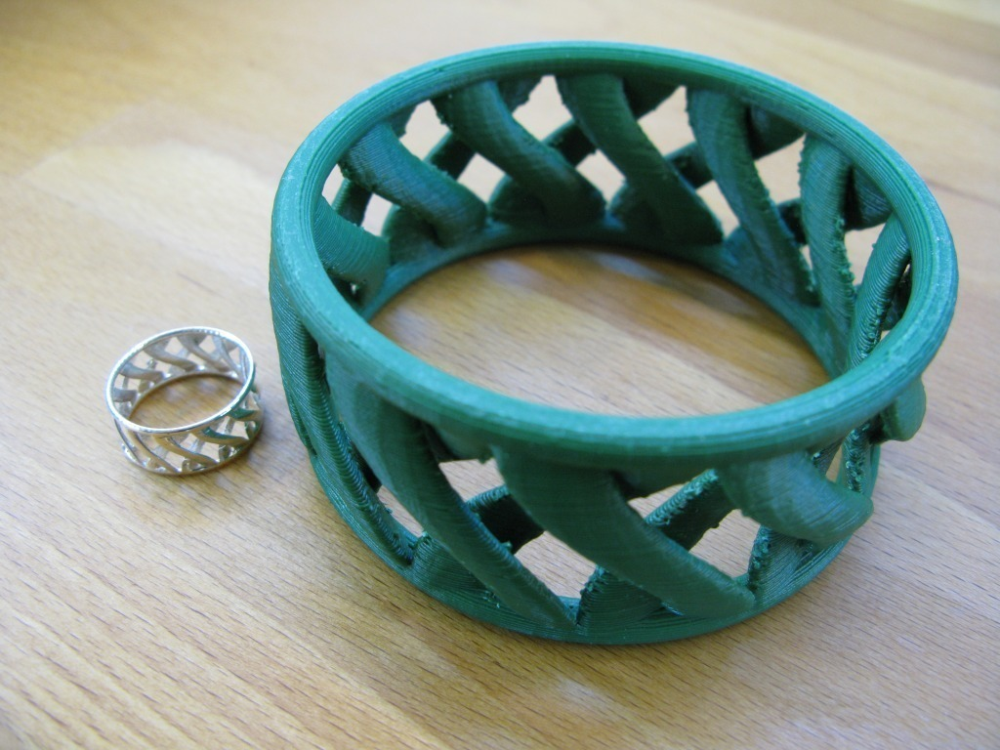
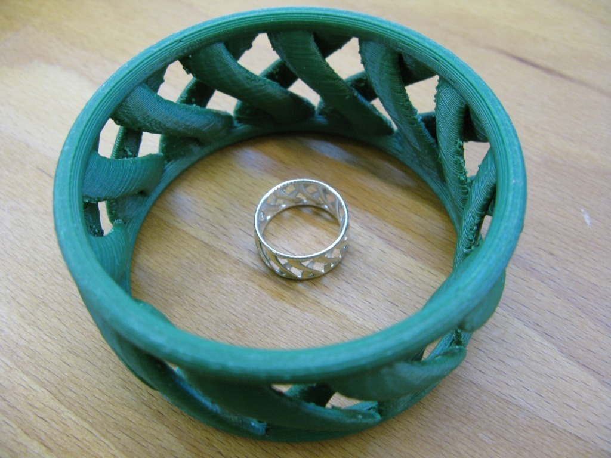
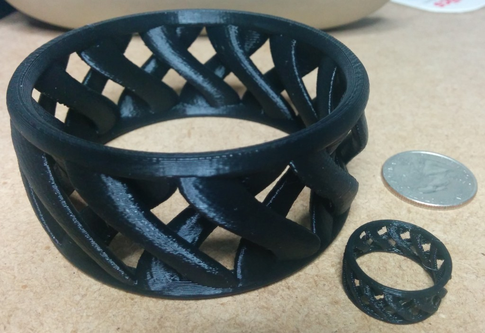

Tags
--------
bracelet , openscad , spiral  

  

License
--------
linkBracelet (or Ring when scaled!) by MakeALot is licensed under the BSD License license.  

By: Mark Durbin (MakeALot)
--------
<http://NestedCube.com/>