two colour calibration cubes
===============
**Please note: This thing is part of a list that was [automatically generated](https://github.com/carlosgs/export-things) and may have been updated since then. Make sure to check for the current license and authorship.**  

two colour calibration cubes  by MakeALot , published Sep 30, 2011

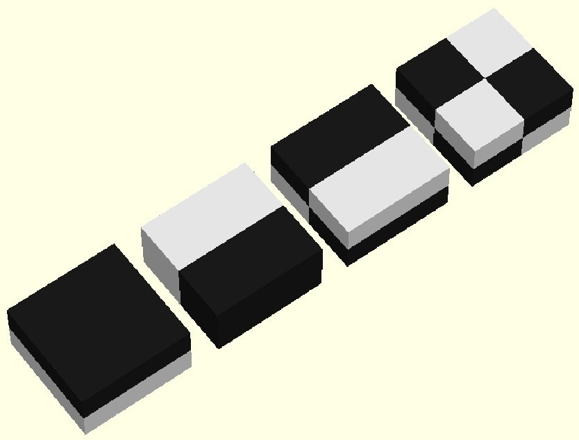

Description
--------
For those lucky enough to be testing their dualstruders (you know who you are), this might help? 
 
I should, of course, mention <a href="http://www.thingiverse.com/thing:6632" target="_blank" rel="nofollow">thingiverse.com/thing:6632</a> by ScribbleJ, the first 2 color calibration cube on Thingiverse - as far as I can see.

Instructions
--------
Print paired cubes: 
 
cube1 a with cube1 b 
cube2 a with cube2 b 
cube3 a with cube3 b 
cube4 a with cube4 b 
cubes a with cubes b

Files
--------

 [ cube4_a.stl](cube4_a.stl)  

[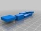](cubes_b.stl)
 [ cubes_b.stl](cubes_b.stl)  

 [ cube2_a.stl](cube2_a.stl)  

 [ TCCC.scad](TCCC.scad)  

[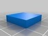](cube1_b.stl)
 [ cube1_b.stl](cube1_b.stl)  

 [ TCCC_all.zip](TCCC_all.zip)  

 [ cube1_a.stl](cube1_a.stl)  

[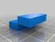](cube3_a.stl)
 [ cube3_a.stl](cube3_a.stl)  

[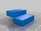](cube3_b.stl)
 [ cube3_b.stl](cube3_b.stl)  

[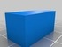](cube2_b.stl)
 [ cube2_b.stl](cube2_b.stl)  

 [ cubes_a.stl](cubes_a.stl)  

[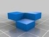](cube4_b.stl)
 [ cube4_b.stl](cube4_b.stl)  

Pictures
--------
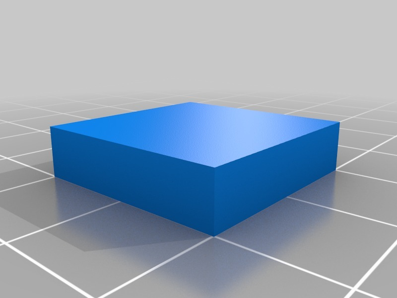

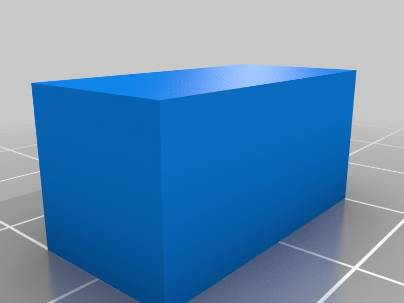

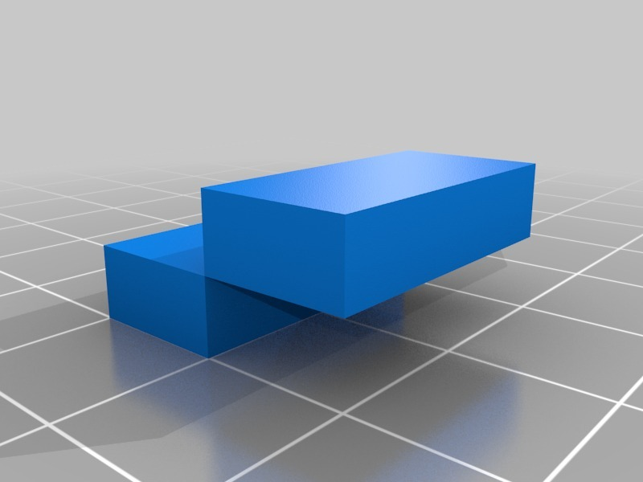
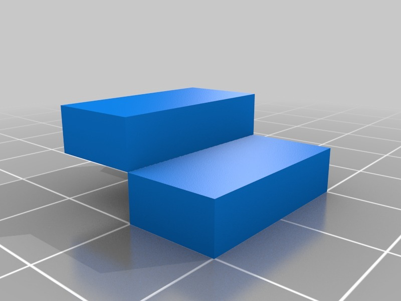
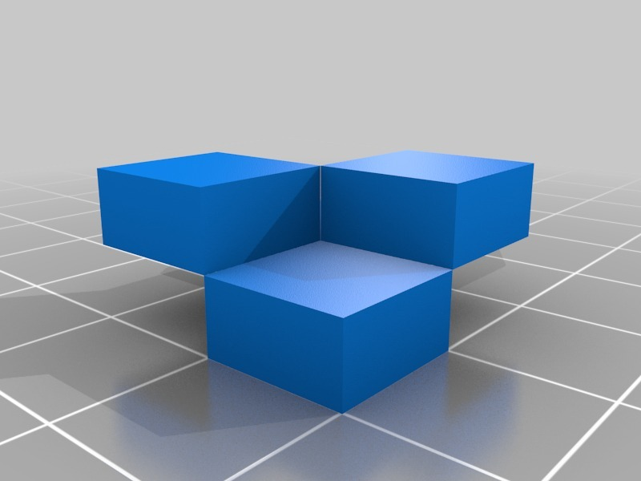
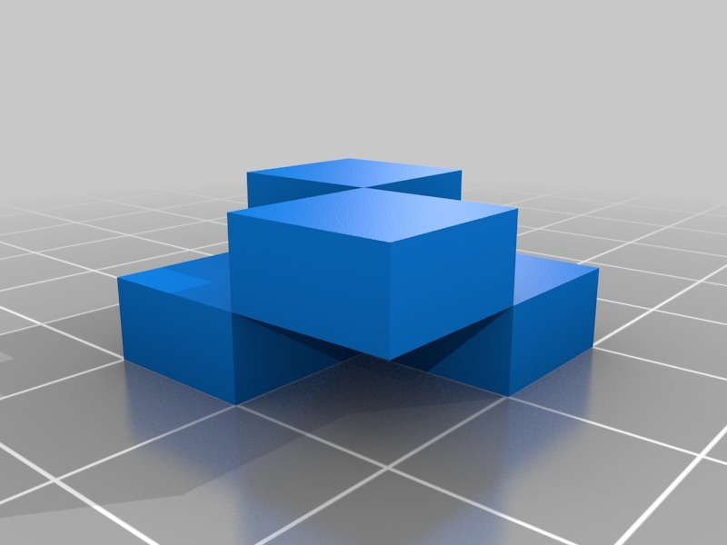
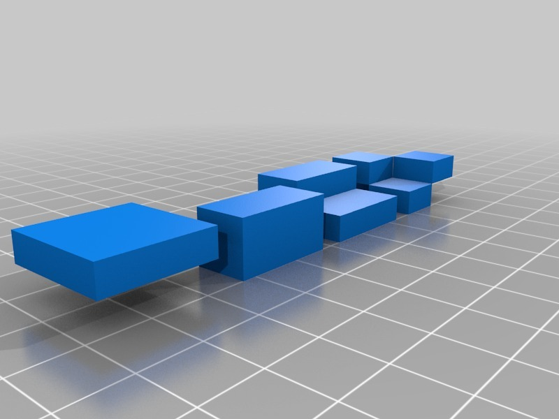
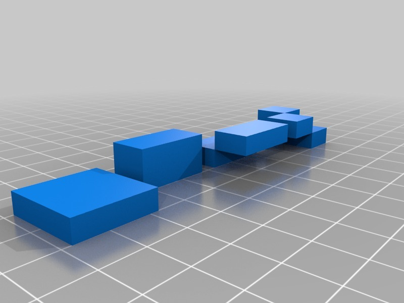

Tags
--------
calibration cube , 2color , Calibration , cube , dual , dualstruder , dualstrusion , openscad  

  

License
--------
two colour calibration cubes by MakeALot is licensed under the Creative Commons - Attribution license.  

By: Mark Durbin (MakeALot)
--------
<http://NestedCube.com/>