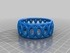

bracelet II
===============
**Please note: This thing is part of a list that was [automatically generated](https://github.com/carlosgs/export-things) and may have been updated since then. Make sure to check for the current license and authorship.**  

bracelet II  by MakeALot , published Mar 26, 2011

Description
--------
bracelet for my daughter that can be generated from OpenSCAD

Instructions
--------
I can't see any reason why it wouldn't print well, but I'm away from my printer at the moment and so it's a work in progress.

Files
--------

 [ braceletII.scad](braceletII.scad)  

 [ braceletII.stl](braceletII.stl)  

Pictures
--------

Tags
--------
bracelet , jewelry , openscad , wearable  

  

License
--------
bracelet II by MakeALot is licensed under the BSD License license.  

By: Mark Durbin (MakeALot)
--------
<http://NestedCube.com/>